<sup>a</sup> Department of Physical Geography and Ecosystem Science,
Lund University, Sweden

<sup>b</sup> Department of Materials Science and Applied Mathematics,
Malmö University, Sweden

https://web.nateko.lu.se/TIMESAT

2023-03-22

[1 Introduction [6](#introduction)](#introduction)

[1.1 About TIMESAT and the software manual
[6](#about-timesat-and-the-software-manual)](#about-timesat-and-the-software-manual)

[1.2 TIMESAT version 4.1 vs. version 3.3
[7](#timesat-version-4.1-vs.-version-3.3)](#timesat-version-4.1-vs.-version-3.3)

[1.3 TIMESAT home page [7](#timesat-home-page)](#timesat-home-page)

[1.4 Using and citing TIMESAT
[7](#using-and-citing-timesat)](#using-and-citing-timesat)

[1.5 Applications of TIMESAT
[7](#applications-of-timesat)](#applications-of-timesat)

[1.6 About the authors [8](#about-the-authors)](#about-the-authors)

[2 Overview of data processing
[11](#overview-of-data-processing)](#overview-of-data-processing)

[2.1 Sequential data [11](#sequential-data)](#sequential-data)

[2.2 Image data [13](#image-data)](#image-data)

[3 Methodology [14](#methodology)](#methodology)

[3.1 Base level [15](#base-level)](#base-level)

[3.2 Least-squares fitting
[15](#least-squares-fitting)](#least-squares-fitting)

[3.3 On the use of ancillary quality data for assigning weights
[15](#on-the-use-of-ancillary-quality-data-for-assigning-weights)](#on-the-use-of-ancillary-quality-data-for-assigning-weights)

[3.4 Pre-processing to remove spikes and outliers
[15](#pre-processing-to-remove-spikes-and-outliers)](#pre-processing-to-remove-spikes-and-outliers)

[3.5 Adaption to the upper envelope
[16](#adaption-to-the-upper-envelope)](#adaption-to-the-upper-envelope)

[3.6 Determination of the number of seasons
[17](#determination-of-the-number-of-seasons)](#determination-of-the-number-of-seasons)

[3.7 Smoothing spline [18](#smoothing-spline)](#smoothing-spline)

[3.8 Fits to double logistic functions
[18](#fits-to-double-logistic-functions)](#fits-to-double-logistic-functions)

[4 Extraction of seasonality parameters
[18](#extraction-of-seasonality-parameters)](#extraction-of-seasonality-parameters)

[4.1 Seasonality parameters derived from time-series spanning n years
[19](#seasonality-parameters-derived-from-time-series-spanning-n-years)](#seasonality-parameters-derived-from-time-series-spanning-n-years)

[4.2 Extracting seasonality parameters from one year of data
[19](#extracting-seasonality-parameters-from-one-year-of-data)](#extracting-seasonality-parameters-from-one-year-of-data)

[4.3 Defining start and end of season
[20](#defining-start-and-end-of-season)](#defining-start-and-end-of-season)

[4.4 Extracted seasonality parameters
[20](#extracted-seasonality-parameters)](#extracted-seasonality-parameters)

[5 Aspects of processing
[22](#aspects-of-processing)](#aspects-of-processing)

[5.1 Characteristics of the processing methods
[22](#characteristics-of-the-processing-methods)](#characteristics-of-the-processing-methods)

[5.2 Controlling the processing: input settings
[22](#controlling-the-processing-input-settings)](#controlling-the-processing-input-settings)

[5.3 Description of input settings
[24](#description-of-input-settings)](#description-of-input-settings)

[6 Output data [30](#output-data)](#output-data)

[6.1 Files with time-series: \*.tts
[30](#files-with-time-series-.tts)](#files-with-time-series-.tts)

[6.2 Files with seasonality parameters: \*.tpa
[30](#files-with-seasonality-parameters-.tpa)](#files-with-seasonality-parameters-.tpa)

[6.3 Extracting images of seasonality parameters
[31](#extracting-images-of-seasonality-parameters)](#extracting-images-of-seasonality-parameters)

[6.4 Output files from ASCII data
[31](#output-files-from-ascii-data)](#output-files-from-ascii-data)

[6.5 Index files [32](#index-files)](#index-files)

[7 Installation of TIMESAT and program structure
[34](#installation-of-timesat-and-program-structure)](#installation-of-timesat-and-program-structure)

[7.1 System requirements
[34](#system-requirements)](#system-requirements)

[7.2 Installation [34](#installation)](#installation)

[8 Program and processing overview
[36](#program-and-processing-overview)](#program-and-processing-overview)

[8.1 Processing logic [36](#processing-logic)](#processing-logic)

[8.2 Program versions [37](#program-versions)](#program-versions)

[9 Getting started with TIMESAT – a quick tutorial
[39](#getting-started-with-timesat-a-quick-tutorial)](#getting-started-with-timesat-a-quick-tutorial)

[9.1 Data [39](#data)](#data)

[9.2 Starting the TIMESAT menu system
[40](#starting-the-timesat-menu-system)](#starting-the-timesat-menu-system)

[9.3 GeoTiff to ENVI binary images
[40](#geotiff-to-envi-binary-images)](#geotiff-to-envi-binary-images)

[9.4 View input/output images
[41](#view-inputoutput-images)](#view-inputoutput-images)

[9.5 TIMESAT Lab [43](#timesat-lab)](#timesat-lab)

[9.6 TSF_process [47](#tsf_process)](#tsf_process)

[9.7 Post-processing the results of a TSF_process run
[47](#post-processing-the-results-of-a-tsf_process-run)](#post-processing-the-results-of-a-tsf_process-run)

[9.8 Checklist for processing new vegetation index image data
[47](#checklist-for-processing-new-vegetation-index-image-data)](#checklist-for-processing-new-vegetation-index-image-data)

[10 Reference manual [47](#reference-manual)](#reference-manual)

[10.1 TSM_menu [48](#tsm_menu)](#tsm_menu)

[10.2 View input/output images
[48](#view-inputoutput-images-1)](#view-inputoutput-images-1)

[10.3 TSM_GUI [48](#tsm_gui)](#tsm_gui)

[10.4 Data input for TSM_GUI
[48](#data-input-for-tsm_gui)](#data-input-for-tsm_gui)

[10.5 Settings in TSM_GUI
[48](#settings-in-tsm_gui)](#settings-in-tsm_gui)

[10.6 Output files from TSM_GUI
[49](#output-files-from-tsm_gui)](#output-files-from-tsm_gui)

[10.7 TSM_settings [49](#tsm_settings)](#tsm_settings)

[10.8 TSF_process [49](#tsf_process-1)](#tsf_process-1)

[10.9 TSF_process parallel
[49](#tsf_process-parallel)](#tsf_process-parallel)

[10.10 TSM_fileinfo [49](#tsm_fileinfo)](#tsm_fileinfo)

[10.11 TSM_printseasons [50](#tsm_printseasons)](#tsm_printseasons)

[10.12 TSM_viewfits [50](#tsm_viewfits)](#tsm_viewfits)

[10.13 TSF_fit2time [50](#tsf_fit2time-1)](#tsf_fit2time-1)

[10.14 TSF_fit2img [50](#tsf_fit2img-1)](#tsf_fit2img-1)

[10.15 TSF_seas2img [50](#tsf_seas2img-1)](#tsf_seas2img-1)

[10.16 Running from the command prompt to automate processing
[50](#running-from-the-command-prompt-to-automate-processing)](#running-from-the-command-prompt-to-automate-processing)

[10.17 Working in Linux and Mac as compared to Windows
[50](#working-in-linux-and-mac-as-compared-to-windows)](#working-in-linux-and-mac-as-compared-to-windows)

[10.18 Input files for TIMESAT
[51](#input-files-for-timesat)](#input-files-for-timesat)

[10.19 Output files for TIMESAT
[54](#output-files-for-timesat)](#output-files-for-timesat)

[10.20 Index files [54](#index-files-1)](#index-files-1)

[11 Acknowledgements [54](#acknowledgements)](#acknowledgements)

[12 References [54](#references)](#references)

Part I

Introduction to TIMESAT

# Introduction

Time-series of vegetation index derived from satellite spectral
measurements can be used to gain information on seasonal vegetation
development. This information aids analyzes of the functional and
structural characteristics of the global and regional land cover and
adds to our current knowledge of global cycles of energy and matter.
Long time-series of vegetation index data can also provide information
on shifts in the spatial distribution of bio-climatic zones, indicating
variations in large-scale circulation patterns or land-use changes.

Although the value of remotely sensed time-series data for monitoring
vegetation seasons has been firmly established, only a limited number of
generally available methods exist for exploring and extracting
seasonality parameters from such data series. For this reason, the
TIMESAT program package for extracting seasonal parameters has been
developed.

## About TIMESAT and the software manual

The TIMESAT 4.1 software manual consists of <span class="mark">three
parts. Part I gives general information together with examples of some
applications of TIMESAT. Part II describes the algorithms underlying the
software package. Also the settings affecting the processing are
discussed in detail. Part III is the software user’s guide, with
detailed information on how to install, run, and handle the program
package.</span>

The TIMESAT program package is designed primarily for analyzing
time-series of satellite data and uses an adaptive smoothing splines
method, fits to double logistic model functions, and adjust double
logistic function fitting based on smoothing splines (Jönsson and
Eklundh, 2002, 2003, 2004). From the fitted model functions a number of
seasonality parameters, e.g., beginning and end of the growing season,
can be extracted. Parameters for a number of pixels can be merged into a
map displaying seasonality on a regional or global scale.

TIMESAT consists of a number of numerical and graphical routines coded
in MATLAB and Fortran. TIMESAT is normally run from the graphical user
interface, which calls Fortran applications from GUI. Fortran routines
are highly vectorized and efficient for use with large data sets. The
Fortran routines are pre-compiled for Windows, Mac-OS, and Linux.

TIMESAT has been developed over many years. During these years a number
of new features have been added. Below are the main features of TIMESAT
4.1:

- Contains several smoothing methods for time-series data

- Adopts to irregular time step input

- Contains several methods for detection of outliers and filling gaps

- Allows for weighting of data using quality information

- Allows for fitting to the upper envelope of the data

- Contains four methods for defining start and end of growing seasons

- Generates 13 seasonality parameters

- Individual processing for different land cover classes

- Versatile graphical user interface (GUI)

- Python interface

- Runs under Linux, Mac-OS and Windows

- Allows for parallel processing on multi-core computers to handle
  massive data sets

## TIMESAT version 4.1 vs. version 3.3

There are some changes in TIMESAT version 4.1 compared to version 3.3.
The most important of these changes are:

- Simplify the installation steps.

- New graphical user interface.

- Adapted to irregular time step input.

- Allows Excel data input.

- Required time vector input.

- Changed the settings file format.

- Defined ENVI binary format as the default image format.

- Added function to convert Tiff to ENVI format

For backward compatibility some obsolete routines are kept.

## TIMESAT home page

On the TIMESAT home page http://www.nateko.lu.se/TIMESAT/TIMESAT.asp the
full program package, along with documentation and test data sets, is
available for download in the form of a zip-file. The installation of
the package from the zip-file is described in section 7.2 in Part III of
this manual. **On the home page there are also answers to frequently
asked questions as well as other information**.

## Using and citing TIMESAT

TIMESAT is provided to the scientific community for non-commercial and
non-military purposes. However, the intellectual ownership and the right
to distribute the program remains with the creators. Access to the
software is granted upon registration. Users of TIMESAT should quote
this document and our two main publications:

Cai, Z., Eklundh, L., and Jönsson, P., 2022, TIMESAT 4.1 Software
Manual, Lund and Malmö University, Sweden.

Jönsson, P. and Eklundh, L., 2002, Seasonality extraction and noise
removal by function fitting to time-series of satellite sensor data,
IEEE Transactions of Geoscience and Remote Sensing, 40, No 8, 1824 –
1832.

Jönsson, P. and Eklundh, L., 2004, TIMESAT - a program for analyzing
time-series of satellite sensor data, Computers and Geosciences, 30, 833
– 845.

TIMESAT is the intellectual property of Zhanzhang Cai, Lars Eklundh,
Lund University, Sweden and Per Jönsson, Malmö University, Sweden. In
case of questions, suggestions or any comments please contact the
authors by e-mail at <zhanzhang.cai@nateko.lu.se>,
lars.eklundh@nateko.lu.se and per.jonsson@mah.se . We cannot guarantee
user support, but we will do our best to answer questions.

## Applications of TIMESAT

TIMESAT has been used in a number of applications, e.g. for
characterizing phenology (Eklundh and Jönsson 2003) and for mapping
environmental and phenological changes in Africa from 1982 till today
(Eklundh and Olsson 2003, Olsson et al. 2005, Seaquist et al. 2006,
Heumann et al. 2007, Hickler et al. 2005, Seaquist et al. 2009), for
improving data in ecosystem classification (Tottrup et al. 2007), for
use with MSG SEVIRI data (Stisen et al. 2007), for mapping high-latitude
forest phenology (Beck et al. 2007), and to evaluate satellite and
climate data-derived indices of fire risk in savanna ecosystems
(Verbesselt et al. 2006) as well as to monitor human footprints on fire
seasons (Le Page et al. 2010).

We use TIMESAT as an integrated part in our development of carbon models
based on data from Terra/MODIS (Olofsson and Eklundh 2007, Olofsson et
al. 2007, 2008, Sjöström et al. 2009, 2011, Schubert et al. 2010, 2012)
and Sentinel-2 (Cai et al. 2021, Junttila et al, 2021, 2023), and for
analyzing relationships between NDVI of nemoboreal and boreal coniferous
forests and models of conifer cold hardiness, bud burst and
photosynthetic efficiency (Jönsson et al. 2010). We also use TIMESAT
with Terra/MODIS data in the development of systems for detection of
forest disturbances, e.g. due to insect infestations (Eklundh et al.
2009).

A modified version of TIMESAT v. 2.3 is integrated in the processing of
MODIS data into a phenology product (MOD09PHN and MOD15PHN) by the North
American Carbon Program (Gao et al. 2008).

TIMESAT has also been used for improving the data quality of MODIS and
AVHRR satellite products (Yuan et al. 2011, Fensholt and Proud 2012,
Barichivich et al. 2013). A more complete summary of applications of
TIMESAT is given in L. Eklundh and P. Jönsson. "TIMESAT: A software
package for time-series processing and assessment of vegetation
dynamics," in Remote Sensing Time Series, C. Kuenzer, S. Dech and W.
Wagner, Ed. Heidelberg: Springer, 2015, pp. 141-158.

Currently, TIMESAT has also been used in Copernicus HR-VPP products,
Copernicus CGLOPS-1 LSP product, ESA’s RAMONA project, and ESA’s SEN4LDN
project.

## About the authors

|  | Zhanzhang Cai received the Ph.D. degree in geobiosphere science with specialization in physical geography and ecosystem science from Lund University, Lund, Sweden in 2019. From 2020 to 2022, he was a Post Doctoral researcher at Lund University, funded by European Environment Agency (EEA) High Resolution Vegetation Phenology and Productivity (HR-VPP) project. He is currently researcher at Lund University, funded by EEA and the Swedish National Space Board. His primary research interest is remote sensing for vegetation phenology, carbon cycle, agriculture, and water quality. |
|:--:|----|
|  | Lars Eklundh received the Ph.D. degree in physical geography from Lund University, Lund, Sweden in 1996. He is currently Professor at Lund University. He was with the United Nations Environment Program (UNEP) from 1989 to 1992. His primary research interest is remote sensing for the analysis of spatial and temporal variation of vegetation parameters. Main fields of application include climate variability, carbon cycle research, phenology, and forest disturbances. He is funded by the Swedish National Space Board and the Swedish Research Council FORMAS. |
|  | Per Jönsson studied mathematics, physics, and astronomy and received the Ph.D. degree in physics from Lund University, Lund, Sweden in 1995. From 1995 to 1997 he was a Post Doctoral Research Assistant in computer science at Vanderbilt University, Nashville, USA. He holds a position as Professor in applied mathematics at Malmö University, Sweden. His primary research interest is in computational science with applications to atomic- plasma-, and astrophysics. More recently he has geared into remote sensing and ecosystem analysis. Per is a partner in the program for remote sensing and phenology modeling for detecting forest changes due to climate change. His research in remote sensing is supported by the Swedish National Space Board. |

Part II

Algorithm Theoretical Basis Document

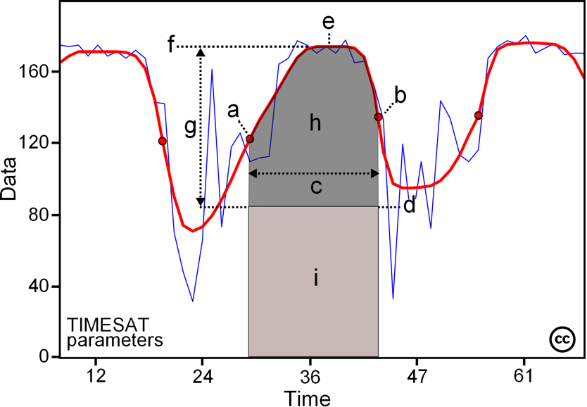

Some of the seasonality parameters generated in TIMESAT: (a) beginning
of season, (b) end of season, (c) length of season, (d) base value, (e)
time of middle of season, (f ) maximum value, (g) amplitude, (h) small
integrated value, (h+i) large integrated value. This figure is licensed
under a Creative Commons Attribution-NonCommercial-NoDerivs 2.5 Sweden
License. It is free to copy and use in other work.

# Overview of data processing

TIMESAT is primarily designed to process time-series of vegetation index
derived from satellite spectral measurements. However, other types of
data such as meteorological index, fire data, and eddy co-variance
carbon flux data can also be processed (Verbesselt et al., 2006, Le Page
et al., 2010). Ancillary quality data may also be used to guide the
processing of the time-series. Sequential data as well as data organized
in images (two-dimensional spatial arrays) can be handled.

## Sequential data

### ASCII format

In the simplest setting TIMESAT processes a number of time-series in an
ASCII file. The first line of the ASCII file gives information about the
number of years spanned by the time-series, $`nyear`$, the number of
data values per year, nptperyear, and the number of time-series in the
file, $`nts`$. Below the first line the time-series
$`y_{1},\ y_{2},\ .\ .\ .\ ,y_{N}`$ , with $`N`$ input data, are given
line by line. In total there are nts lines with time-series. Optionally,
the time-series file is accompanied with a file in the same format with
quality indicators $`q_{1},\ q_{2},\ .\ .\ .\ ,q_{N}`$ . Given the
number of data values per year, the indices $`1,\ 2,\ .\ .\ .\ ,\ N`$ of
the time-series directly translates to time values
$`t_{1},\ t_{2},\ .\ .\ .\ ,t_{N}\`$ . The data structure of the ASCII
file is displayed in Figure 1.

| Time vector file: | Data file: | Quality file: |
|----|----|----|
| 
``` math
N\ \ \ \ \ \ \ \ \ \ \ \ \ \ 
``` | 
``` math
\ N\ \ \ \ nts\ \ \ \ \ \ \ \ \ \ \ \ \ \ \ \ \ \ \ \ \ \ \ \ \ \ \ \ \ \ \ \ \ 
``` | 
``` math
N\ \ \ \ nts\ \ \ \ \ \ \ \ \ \ \ \ \ \ \ \ \ \ \ \ \ \ \ \ \ \ \ \ \ \ \ \ \ 
``` |
| 
``` math
\left. \ \begin{array}{r}
\begin{matrix}
t_{1}\ \ \ \  \\
t_{2}\ \ \ \  \\
 \vdots 
\end{matrix} \\
t_{N}\ \ 
\end{array} \right\}\ N
``` | 
``` math
\left. \ \begin{array}{r}
\begin{matrix}
y_{1}\ \ \ \ \ y_{2}\ \ \ \ .\ .\ .\ \ \ \ \ y_{N}\ \  \\
y_{1}\ \ \ \ \ y_{2}\ \ \ \ .\ .\ .\ \ \ \ \ y_{N}\ \  \\
 \vdots 
\end{matrix} \\
y_{1}\ \ \ \ \ y_{2}\ \ \ \ .\ .\ .\ \ \ \ \ y_{N}\ \ 
\end{array} \right\}\ nts
``` | 
``` math
\left. \ \begin{array}{r}
\begin{matrix}
q_{1}\ \ \ \ \ q_{2}\ \ \ \ .\ .\ .\ \ \ \ \ q_{N}\ \  \\
q_{1}\ \ \ \ \ q_{2}\ \ \ \ .\ .\ .\ \ \ \ \ q_{N}\ \  \\
 \vdots 
\end{matrix} \\
q_{1}\ \ \ \ \ q_{2}\ \ \ \ .\ .\ .\ \ \ \ \ q_{N}\ \ 
\end{array} \right\}\ nts
``` |

Figure 1: *Data structure of ASCII files containing time-series. The
first line of the file gives information about the number of data
values,* $`N`$*, and the number of time-series in the file,* $`nts`$*.
After the first line with general data the time-series are given line by
line. The format of time vector,* $`t`$*, is YYYYDOY, where YYYY is year
and DOY is day of year, e.g., 2022132.*

Given the ASCII file with time-series and, optionally, a file with
quality indicators and a file with input settings
(<span class="mark">see sections 5.2 and 5.3</span>), TIMESAT fits a
smooth function to each of the time-series and extracts seasonality data
such as start and end of the season or length of season. The steps of
the processing are summarized below.

1.  Read input settings that define the processing of the time-series.

2.  Read first line of the ASCII files giving information about the
    length and sampling of a time-series as well as the number of
    time-series.

3.  Loop over the time-series in the file.

    1.  Read time vector $`t_{1},\ t_{2},\ .\ .\ .\ ,t_{N}`$,
        time-series $`y_{1},\ y_{2},\ .\ .\ .\ ,y_{N}`$ and, optionally,
        quality indicators $`q_{1},\ q_{2},\ .\ .\ .\ ,q_{N}`$.

    2.  Pre-process time-series under the guidance of the quality
        indicators.

    3.  Fit a smooth function to the time-series.

    4.  Use fitted function to extract seasonality parameters.

    5.  Write seasonality parameters and fitted function to file.

The original time-series and the fitted functions can be displayed by
the TIMESAT routines or by user programs written in e.g. MATLAB. In
Figure 2 we display a processed time-series covering five years. The
start and end of the seasons are marked with filled circles.

Settings defining the regression model for the fits, how outliers and
quality data are handled etc. are given in the input settings file. For
convenience the settings are summarized in sections 5.2 and 5.3 of this
document. The input settings file can be created manually or, better, by
using the TIMESAT graphical user interface (GUI). The user interface is
described in Part III of this manual.

<figure>
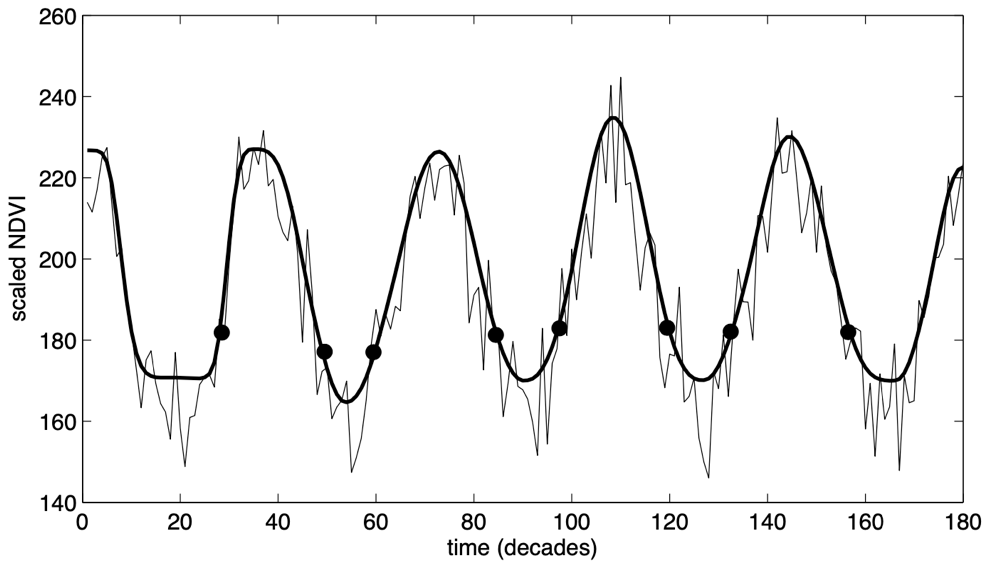
<figcaption><p>Figure 2. Time-series <span
class="math inline"><em>y</em><sub>1</sub>, <em>y</em><sub>2</sub>, . . . , <em>y</em><sub><em>N</em></sub></span>
covering a period of 5 years. Seasonality parameters from the 5 full
seasons are determined from the fitted functions</p></figcaption>
</figure>

### Excel format

TIMESAT allows data to be entered in Excel file format. The first column
of Sheet 1 of the Excel file is the time vector. Each of the next
columns represents a time series. When there is no data for a y-value,
the cell can be empty. Sheet 2 provides quality data. The format is the
same as sheet 1.

Table 1. *Data structure of Excel files containing time-series. The
first line of the file gives information about the number of data
values,* $`N`$*, and the number of time-series in the file,* $`nts`$*.
After the first line with general data the time-series are given line by
line. The format of time vector,* $`t`$*, is yyyy-mm-dd, where yyyy is
year; mm is month, and dd is date of year, e.g., 2022-01-01.*

<table style="width:100%;">
<colgroup>
<col style="width: 9%" />
<col style="width: 9%" />
<col style="width: 9%" />
<col style="width: 9%" />
<col style="width: 9%" />
<col style="width: 9%" />
<col style="width: 9%" />
<col style="width: 9%" />
<col style="width: 9%" />
<col style="width: 9%" />
<col style="width: 9%" />
</colgroup>
<thead>
<tr>
<th colspan="5" style="text-align: center;">Sheet 1</th>
<th style="text-align: center;"></th>
<th colspan="5" style="text-align: center;">Sheet 2</th>
</tr>
</thead>
<tbody>
<tr>
<td style="text-align: center;">Date</td>
<td style="text-align: center;">TS<sub>1</sub></td>
<td style="text-align: center;">TS<sub>2</sub></td>
<td style="text-align: center;"><span
class="math display">.. .</span></td>
<td style="text-align: center;">TS<sub>npt</sub></td>
<td style="text-align: center;"></td>
<td style="text-align: center;">Date</td>
<td style="text-align: center;">TS<sub>1</sub></td>
<td style="text-align: center;">TS<sub>2</sub></td>
<td style="text-align: center;"><span
class="math display">.. .</span></td>
<td style="text-align: center;">TS<sub>npt</sub></td>
</tr>
<tr>
<td style="text-align: center;"><span
class="math display"><em>t</em><sub>1</sub></span></td>
<td style="text-align: center;"><span
class="math display"><em>y</em><sub>1</sub></span></td>
<td style="text-align: center;"><span
class="math display"><em>y</em><sub>1</sub></span></td>
<td style="text-align: center;"><span
class="math display">. . .</span></td>
<td style="text-align: center;"><span
class="math display"><em>y</em><sub>1</sub></span></td>
<td style="text-align: center;"></td>
<td style="text-align: center;"><span
class="math display"><em>t</em><sub>1</sub></span></td>
<td style="text-align: center;"><span
class="math display"><em>q</em><sub>1</sub></span></td>
<td style="text-align: center;"><span
class="math display"><em>q</em><sub>1</sub></span></td>
<td style="text-align: center;"><span
class="math display">. . .</span></td>
<td style="text-align: center;"><span
class="math display"><em>q</em><sub>1</sub></span></td>
</tr>
<tr>
<td style="text-align: center;"><span
class="math display"><em>t</em><sub>2</sub></span></td>
<td style="text-align: center;"><span
class="math display"><em>y</em><sub>2</sub></span></td>
<td style="text-align: center;"><span
class="math display"><em>y</em><sub>2</sub></span></td>
<td style="text-align: center;"><span
class="math display">. . .</span></td>
<td style="text-align: center;"><span
class="math display"><em>y</em><sub>2</sub></span></td>
<td style="text-align: center;"></td>
<td style="text-align: center;"><span
class="math display"><em>t</em><sub>2</sub></span></td>
<td style="text-align: center;"><span
class="math display"><em>q</em><sub>2</sub></span></td>
<td style="text-align: center;"><span
class="math display"><em>q</em><sub>2</sub></span></td>
<td style="text-align: center;"><span
class="math display">. . .</span></td>
<td style="text-align: center;"><span
class="math display"><em>q</em><sub>2</sub></span></td>
</tr>
<tr>
<td style="text-align: center;"><span class="math display">⋮</span></td>
<td style="text-align: center;"><span class="math display">⋮</span></td>
<td style="text-align: center;"><span class="math display">⋮</span></td>
<td style="text-align: center;"><span
class="math display">. . .</span></td>
<td style="text-align: center;"><span class="math display">⋮</span></td>
<td style="text-align: center;"></td>
<td style="text-align: center;"><span class="math display">⋮</span></td>
<td style="text-align: center;"><span class="math display">⋮</span></td>
<td style="text-align: center;"><span class="math display">⋮</span></td>
<td style="text-align: center;"><span
class="math display">. . .</span></td>
<td style="text-align: center;"><span class="math display">⋮</span></td>
</tr>
<tr>
<td style="text-align: center;"><span
class="math display"><em>t</em><sub><em>N</em></sub></span></td>
<td style="text-align: center;"><span
class="math display"><em>y</em><sub><em>N</em></sub></span></td>
<td style="text-align: center;"><span
class="math display"><em>y</em><sub><em>N</em></sub></span></td>
<td style="text-align: center;"><span
class="math display">. . .</span></td>
<td style="text-align: center;"><span
class="math display"><em>y</em><sub><em>N</em></sub></span></td>
<td style="text-align: center;"></td>
<td style="text-align: center;"><span
class="math display"><em>t</em><sub><em>N</em></sub></span></td>
<td style="text-align: center;"><span
class="math display"><em>q</em><sub><em>N</em></sub></span></td>
<td style="text-align: center;"><span
class="math display"><em>q</em><sub><em>N</em></sub></span></td>
<td style="text-align: center;"><span
class="math display">. . .</span></td>
<td style="text-align: center;"><span
class="math display"><em>q</em><sub><em>N</em></sub></span></td>
</tr>
</tbody>
</table>

## Image data

Remotely sensed data are often organized in binary images
(two-dimensional spatial arrays). Though any kind of remotely sensed
data can be used, vegetation index data are very common in time-series
analysis. We will thus refer to time-series image data as vegetation
index data in the following text. Each image gives the vegetation index
values in the array at a specified time. By extracting vegetation index
values at a pixel $`(j,\ k)`$ in the array for consecutive times, a
time-series $`y_{1},\ y_{2},\ .\ .\ .\ ,y_{N}`$ is obtained for this
pixel (see Figure 3). In some cases, data are complemented by quality
data that are organized in images in a similar way.

<figure>
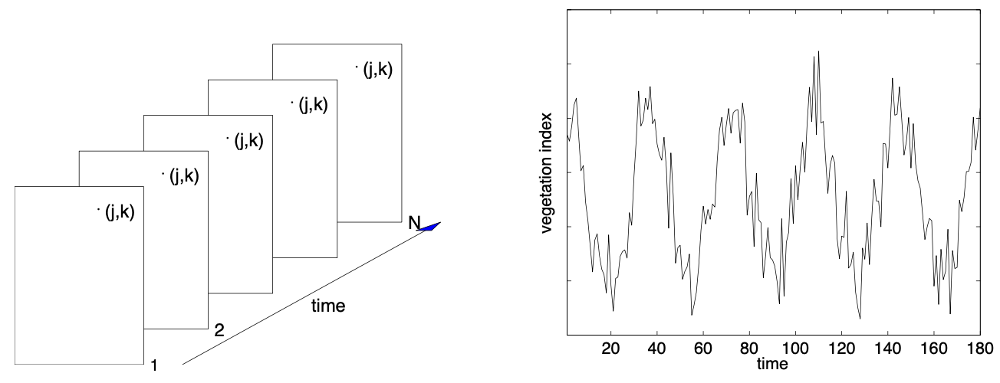
<figcaption><p>Figure 3. Vegetation index data are organized in images
(left panel). An image i gives index values over an area for the time t.
By extracting values at a pixel (j, k) for consecutive times, a
time-series <span
class="math inline"><em>y</em><sub>1</sub>, <em>y</em><sub>2</sub>, . . . , <em>y</em><sub><em>N</em></sub></span>
is obtained for this pixel (right panel). The pixel may be assigned a
land use class, and it is possible to use separate processing schemes
for each class.</p></figcaption>
</figure>

Frequently data have been spatially clustered and each pixel $`(j,\ k)`$
has been assigned a land cover class e.g. water, cropland, deciduous,
and coniferous forest. Time-series in a class share some characteristics
and are sometimes quite different from time-series in other classes. It
is advantageous to be able to use separate processing schemes for each
class.

Given a stack of images with vegetation index and, optionally, a stack
of images with quality indicators, and a file with input settings
(<span class="mark">see sections 5.2 and 5.3</span>), TIMESAT smooths
each of the time-series in a defined area and extracts seasonality data
such as start and end of the season or the length of the season. The
details of the processing, which depends on the assigned land use class
of the pixel, are summarized below.

1.  Read files containing dates and the names of all the images with
    vegetation data, and optionally, the images with quality data. Read
    file with land use classes.

2.  Give spatial extension of the area in the image that should be
    processed. Supply information about the image format (8-bit unsigned
    integer, 16-bit signed integer etc).

3.  Read general as well as land use class-specific input settings that
    define the processing of the time-series.

4.  Loop over pixels $`(j,\ k)`$, serial or in parallel, in the defined
    area. For each pixel:

<!-- -->

1.  Extract time-series $`y_{1},\ y_{2},\ .\ .\ .\ ,y_{N}`$ and,
    optionally, quality indicators $`q_{1},\ q_{2},\ .\ .\ .\ ,q_{N}`$
    from images.

2.  Read land use classification for the current pixel.

3.  Pre-process time-series under the guidance of the quality indicators
    and land use classification.

4.  Fit a smooth function to the time-series.

5.  Use fitted function to extract seasonality parameters.

6.  Write seasonality parameters and fitted function to files.

<!-- -->

5.  Read files with seasonality parameters and generate maps.

Comparing images of the same quantity for consecutive years may reveal
shifts in vegetation coverage due to climate change or other dynamical
events (Eklundh and Olsson 2003, Heumann et al. 2007). In Figure 4, two
images of the seasonal amplitude, as derived from functions fitted to
data from NOAA/AVHRR, in an area covering a portion of N. Eastern Africa
are displayed. The image to the left displays the amplitude in 1982 and
the image to the right displays the amplitude in 2000.

<figure>
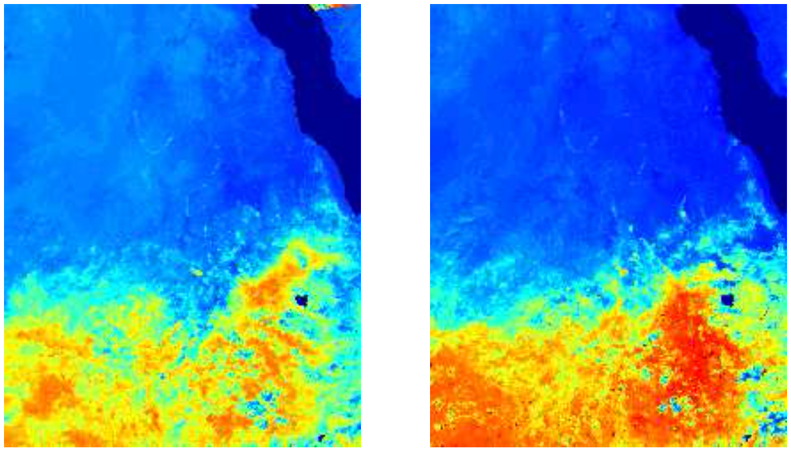
<figcaption><p>Figure 4. Figure 4: Seasonal amplitude in Ethiopia in
1982 and 2000 from functions fitted to data from NOAA/AVHRR. Red is
translated into high amplitude in the image and it is seen that there
are some distinct changes in the vegetation index between the
years.</p></figcaption>
</figure>

# Methodology

TIMESAT implements <span class="mark">three</span> processing methods:
least-squares fitting to double logistic functions (DL), smoothing
spline (SP), and smoothing spline based on double logistic fits (DL-SP).
We start by a general description of base level and weighted
least-squares fits. Pre-processing and removal of outliers are
discussed, and then we go on to describe an iterative method to adapt
the fitted functions to the upper envelope of the data. This is followed
by an account on how to determine the number of annual growing seasons
and their approximate timing. The details of the processing methods are
given, and finally the extraction of seasonality information is
described.

## Base level

The concept of base level was originally introduced by Jönsson et al.
(2018). The base level can be determined as the $`n`$ percentile of the
observation’s histogram for the complete time period. Weights of
observations that are lower than the base level, are set to 0. The base
level is used for filling long term data gaps and assisting the double
logistic function fitting.

## Least-squares fitting

Assume that we have a time-series $`\left( t_{i},y_{i} \right)`$,
$`i = 1,\ 2,\ \ldots,\ N`$ and a model function $`f(t)`$ of the form

$`f(t) = c_{1}\varphi_{1}(t) + c_{2}\varphi_{2}(t) + \ldots + c_{M}\varphi_{M}(t)`$,
(3)

where
$`\varphi_{1}(t),\ \ \varphi_{2}(t),\ \ \ldots,\ \ \varphi_{M}(t)`$ are
given basis functions. The best values, in the least-squares sense, of
the parameters $`c_{1},\ \ c_{2},\ \ \ldots,\ \ c_{M}`$ are obtained by
solving the system of normal equations

$`A^{T}Ac = A^{T}b`$, (4)

where

$`A_{ij} = w_{i}\varphi_{i}\left( t_{i} \right),\ \ \ \ \ \ \ \ \ b_{i} = w_{i}y_{i}`$.
(5)

Here $`w_{i}`$ is the weight of the $`i`$th data value, presumed to be
known. Values with small weights will influence the fit less than values
with large weights. If the weights are not known they may all be set to
the constant value $`w\  = \ 1`$ (Press et al. 1994).

## On the use of ancillary quality data for assigning weights

In TIMESAT cloud classifications and other ancillary data may be used to
assign weights to the values in the time-series, such as the QA quality
labels accompanying the MODIS satellite sensor data. Another example,
used in the TIMESAT tutorial, is the scene classification layer (SCL)
from Sentinel-2 L2A data. Values in the time-series associated with the
SCL can be assigned different weights. In previous work weights w = 1
have been assigned for group 4 and 5, which are vegetation and not
vegetation, w = 0.5 have been assigned for group 3 and 7, which are
cloud shadows and unclassified, w = 0 have been assigned for other
groups. There are, of course, no general rules for converting ancillary
data to weights associated with the values in the time-series, and the
user of the TIMESAT program is encouraged to take an experimental
approach and test different settings. Figure 5(a) depicts a time-series
for which the values have been assigned weights based on the CLAVR
values. Large circles indicate clear conditions (w = 1), small circles
indicate mixed conditions (w = 0.5), and no circle indicate clouds (w =
0). From the figure it is seen that several of the negatively biased
outliers are associated with cloudy conditions. By assigning zero weight
to these cloudy values they will not influence the subsequent fitting.

## Pre-processing to remove spikes and outliers

As we have seen, some spikes and outliers may be detected using
ancillary quality data. In many time-series there are, however,
remaining positive and negative outliers that seriously impair the
function fits. The outlier detection is based on checking the difference
between raw data and an initial smoothing spline fit. A data value is
defined as an outlier following two criteria: (1) it deviates more than
six times global median difference, and (2) it deviates more than six
times local median difference in a moving window (half window width =
45). Since pre-processing is data dependent, we recommend the user to
take an experimental approach and test different settings.

<figure>
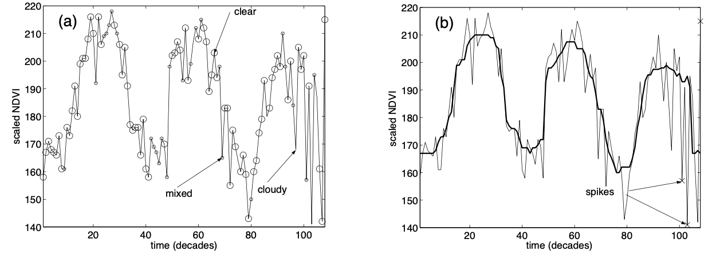
<figcaption><p>Figure 5. (a) Time-series where the values have been
assigned weights: w = 1 (large circles), w = 0.5 (small circles), and w
= 0 (no circle). (b) Time-series together with values from a median
filtering. Values in the time-series that are sufficiently different
from both the left- and right-hand neighbors and the median filtered
value are classified as outliers and are assigned weight 0. Detected
spikes (outliers) are marked by crosses.</p></figcaption>
</figure>

## Adaption to the upper envelope

To take into account that most noise in NDVI and other vegetation
indices generated from re- motely sensed land data is negatively biased,
the determination of the parameters
$`c_{1},\ c_{2},\ .\ .\ .\ ,\ c_{M}`$ of the model function is done in
two or more steps. In the first step the parameters are obtained by
solving the system of normal equations with weight
$`w_{1},w_{2},...,w_{N}`$ obtainedfrom the ancillary cloud data or from
the STL-decomposition. Data values below the model function of the first
fit are thought of as being less important, and in the second step the
system is solved with the weights of the low data values decreased by
some factor. In TIMESAT this can be repeated 2 times. This multi-step
procedure leads to a model function that is adapted to the upper
envelope of the data (see Figure 6).

<figure>
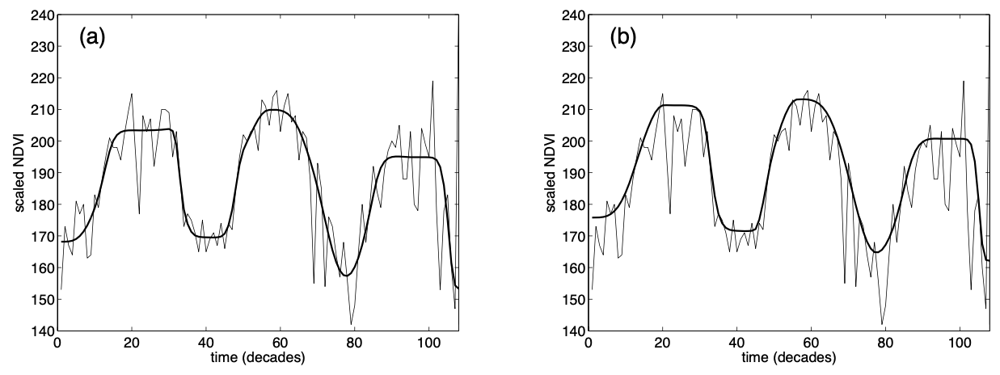
<figcaption><p>Figure 6. Fitted functions from a multi-step procedure.
The thin solid line represent the original NDVI data. (a) The thick line
shows the fitted function from the first step. (b) The thick solid line
displays the fit from the last step where the weights of the low data
values have been decreased.</p></figcaption>
</figure>

## Determination of the number of seasons

### Irregular season

With the high spatial resolution satellite images, e.g., Sentinel-2, we
can capture the variation within crop field. Compared to natural
vegetation, the seasonality on crop land may have more complex
variations. In TIMESAT, smoothing spline is applied to determine the
irregular coarse seasons (see detail in section 3.7). Changing smoothing
parameter $`p`$ can tune the ability to capture more seasons or less
seasons. The value of $`p`$ is determined by the seasonality parameter
by the formula:

$`p = 1000 \times 50^{m},`$ (2)

where $`m`$ is the seasonality parameter, which is set to 0.5 as
default. The range of $`m`$ is in between 0 and 1, corresponding to 1000
and 50000 of the smoothing parameter $`p`$. A smaller $`m`$ leads a
smaller $`p`$, which tends to identify more peaks or potential seasons.
A larger $`m`$ leads a larger $`p`$, which tends to identify less peaks
or potential seasons.

### Regular season

The high level of noise often makes it difficult to determine the number
of annual seasons based on data for only one year. Including data from
surrounding years reduces the risk for erroneous determinations. In
TIMESAT, data values $`(t_{i},{\ y}_{i})`$,
$`i\  = \ 1,\ 2,\ .\ .\ .\ ,\ N`$ in the time-series are fit to a model
function

$`f(t) = c_{1} + c_{2}\sin(wt) + c_{3}\cos(wt) + c_{4}\sin(2wt) + c_{5}{cost}(2wt)`$,
(3)

where ω = 2π · nyear/N. The first basis function determines the base
level whereas the pairs of sine and cosine functions correspond to,
respectively, one and two annual vegetation seasons.

The fitting procedure always gives a primary maximum. In addition, a
secondary maximum may be found. If the amplitude ratio between the
secondary maximum and the primary maximum exceeds a user defined
threshold – the seasonality parameter – we have two annual seasons. If
the amplitude ratio is below the threshold we have one annual season
(see figure 7). By carefully selecting the seasonality parameter TIMESAT
will discriminate between noise and a second annual season. Setting the
seasonality parameter to 1 forces the program to treat data as if there
is one annual season. Setting the seasonality parameter to 0 forces the
program to treat data as if there are two annual seasons. Information on
the number of annual seasons is used further on in the TIMESAT program
to define intervals in which to perform the local fits to Gaussians and
double logistic functions (see section 3.9).

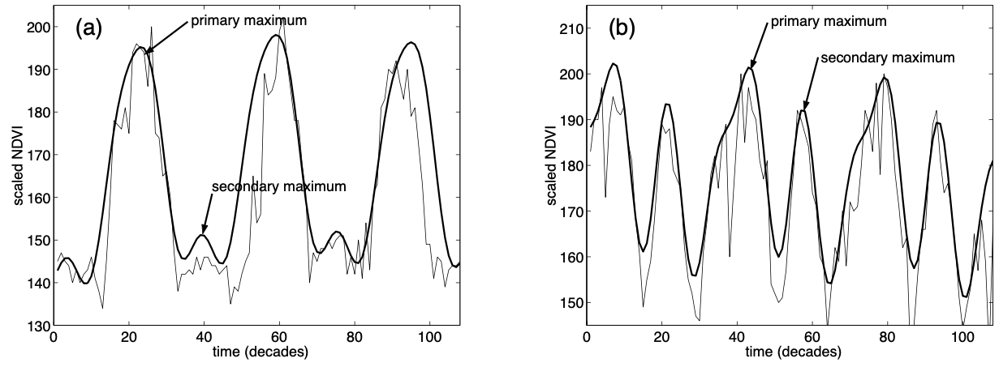

Figure 7. If the amplitude ratio is below a user defined threshold we
have one annual season. If the ratio is above the threshold we have two
annual seasons.

## Smoothing spline

An initial pixel-wise estimate of the growing seasons’ start and stop
dates (“coarse seasons”) is determined by applying a smoothing spline
$`S_{p}(t)`$ (Craven and Wahba, 1978; Woltring, 1986), which minimizes
the value of a criterion function $`C_{p}`$:

$`C_{p} = \sum_{i = 1}^{n}{\left\{ {w_{i}\left\lbrack y_{i} - S_{p}\left( t_{i} \right) \right\rbrack}^{2} + p\int_{- \infty}^{+ \infty}{\left| S_{p}^{„}(t) \right|^{2}dt} \right\},}`$
(4)

where $`n`$ is the number of points, $`t_{i},\ i = 1,\ldots,n`$ is time
vector and $`y_{i}`$ are the corresponding PPI values. Each point in the
time series is associated with a weight $`w_{i}`$. The smoothing
parameter $`p`$ controls the shape of the spline, varying from an
exactly interpolating spline ($`p = 0`$) to a straight line
($`p \rightarrow \infty`$).

## Fits to double logistic functions

Continuous daily seasonal trajectory, $`y_{m}`$, are estimated from
least-squares fitting to double logistic functions (Fischer, 1994;
Jönsson et al., 2018):

``` math
y_{m} = c_{0} + \sum_{i = 1}^{n}{c_{i}\frac{1}{1 + \exp\left( \frac{x_{1}^{i} - t}{x_{2}^{i}} \right)} - \frac{1}{1 + \exp\left( \frac{x_{3}^{i} - t}{x_{4}^{i}} \right)}},
```

where the $`c_{0}`$ is the base level, and $`c_{i}`$ define the
amplitudes for the coarse seasons $`i`$. The parameters $`x_{1}^{i}`$
and $`x_{3}^{i}`$ determine the left and right inflexion points for
season $`i`$, whereas $`x_{2}^{i}`$ and $`x_{4}^{i}`$ determine the time
period of increase and decrease respectively. The initial values of
$`x_{1}^{i}`$ and $`x_{3}^{i}`$ are determined by the time position of
50% of the amplitude of the coarse season.

# Extraction of seasonality parameters

Phenology is the response of vegetation to seasonal climatic cycles in
irradiance, temper- ature and rainfall. Therefore, phenology constitutes
an essential land surface parameter in atmospheric and climate models.
However, the seasonal patterns observed in satellite-derived time-series
data may also be affected by other cyclic and non-cyclic effects. Hence,
we will use the term seasonality when describing these annually
occurring events. Furthermore, seasonality parameters obtained from
satellite derived time-series are often affected by the high degree of
noise in the data. Using fitted functions reduces the uncertainties and
leads to more stable measures.

## Seasonality parameters derived from time-series spanning n years

Consider a time-series with one growing season per year. During a period
of n years there may, in the general case, be n − 1 full seasons
together with two fractions of a season in the beginning and end of the
time-series. Using the fitted functions seasonality parameters can be
extracted for each of the n − 1 full seasons (see Figure 13). If there
are n seasons that each peaks in the middle of a year it would in
principle be possible to extract seasonality parameters from each of the
years (see for example Figure 5b).

<figure>
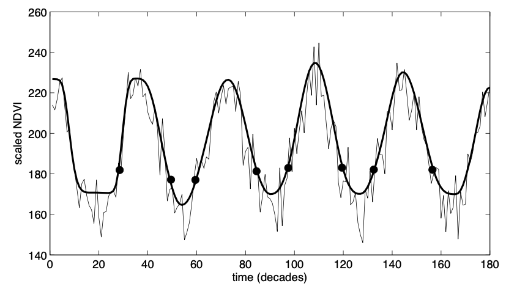
<figcaption><p>Figure 13. Time-series covering a period of 5 years. Only
seasonality parameters from the 4 full seasons can be determined from
fitted functions. The start and end of the seasons are marked with
filled circles.</p></figcaption>
</figure>

## Extracting seasonality parameters from one year of data

If the vegetation season peaks around the middle of the time-series it
is, in principle, possible to extract seasonality parameters from only
one year of data. TIMESAT can handle this case automatically. To
overcome this problem, TIMESAT duplicates the time-series and make an
artificial time-series spanning three years (see Figure 14). The
seasonality parameters extracted from the middle season of this
artificial time-series are the desired ones. Note that this trick can
only be used when the season peaks in the middle of the time-series.

<figure>
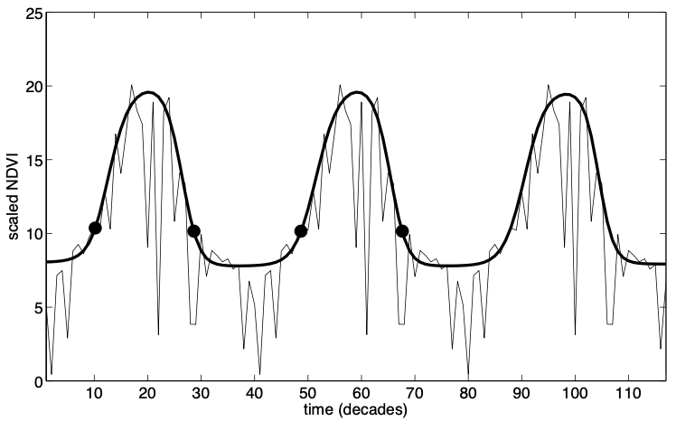
<figcaption><p>Figure 14. To extract seasonality parameters from one
year of data the time-series has been duplicated to span three
years.</p></figcaption>
</figure>

## Defining start and end of season

In TIMESAT 4.1, four methods are used for determining when the seasons
start and end. (1) The first method is based on the seasonal amplitude,
defined between the base level and the maximum value for each individual
season. The start occurs when the left part of the fitted curve has
reached a specified fraction of the amplitude, counted from the base
level. The end of season is defined similarly, but for the right side of
the curve. (2) In the second method, the start/end of season occurs when
the curve has reached an absolute value, defined in the units of the
data. (3) The third method is based on the relative amplitude for the
whole time series. This amplitude is calculated as the difference
between the robust mean maximum and the robust mean base level (the
means of values when excluding the 10 % lowest and highest values). The
start/end occur when the curve has reached a specified fraction of this
relative amplitude. In contrast to method 1, this method will generate
start/end vegetation index values that are identical for all seasons of
a point (pixel), however, the value can vary between different points
(pixels). <span class="mark">The methods are illustrated in Figure
15</span>. The choice of method and threshold values depends on the
vegetation index used, the biological threshold chosen (e.g. start of
season defined as leaf area index exceeding a certain value), and how
this threshold translates into a vegetation index value or fraction of
amplitude for the studied vegetation type.

## Extracted seasonality parameters

In the current version of TIMESAT, a number of key seasonality
parameters such as the time of the start and end of the season, the
largest value, and the amplitude are computed for each of the full
seasons in the time-series. Some of these parameters are displayed in
Figure 16. The use of the fitted function gives more stable measures,
where effects of noise have been reduced. To rule out errors a number of
checks on consistency of the parameters are done.

Below are definitions of all the extracted seasonality parameters. There
are of course no unique definitions of seasonality parameters and
different researchers may argue for different ways of extracting and
validating these parameters. However, the importance of these parameters
lies in the possibility to map out spatial or temporal changes in the
vegetation cover resulting from climatic or land use changes.

<figure>
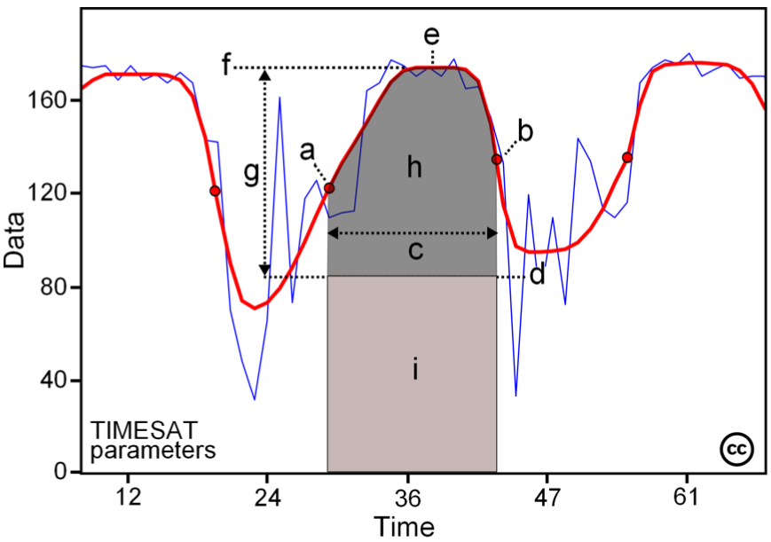
<figcaption><p>Figure 16. Some of the seasonality parameters generated
in TIMESAT: (a) beginning of season, (b) end of season, (c) length of
season, (d) base value, (e) time of middle of season, (f) maximum value,
(g) amplitude, (h) small integrated value, (h+i) large integrated value.
This figure is licensed under a Creative Commons
Attribution-NonCommercial-NoDerivs 2.5 Sweden License. It is free to
copy and use in other work.</p></figcaption>
</figure>

1.  **time for the start of the season;** time for which the left edge
    has increased to a user defined level (often a certain fraction of
    the seasonal amplitude) measured from the left minimum level.

2.  **value for the start of the season;** value of the function at the
    time of the start of the season.

3.  **rate of increase at the beginning of the season;** calculated as
    the ratio of the difference between the left 20 % and 80 % levels
    and the corresponding time difference.

4.  **time for the end of the season;** time for which the right edge
    has decreased to a user defined level measured from the right
    minimum level.

5.  **value for the end of the season;** value of the function at the
    time of the end of the season.

6.  **rate of decrease at the end of the season;** calculated as the
    absolute value of the ratio of the difference between the right 20 %
    and 80 % levels and the corresponding time difference. The rate of
    decrease is thus given as a positive quantity.

7.  **length of the season;** time from the start to the end of the
    season.

8.  **base level;** given as the average of the left and right minimum
    values.

9.  **time for the mid of the season;** time of the seasonal maximum.

10. **largest data value for the fitted function during the season;**
    value of the seasonal maximum.

11. **seasonal amplitude;** difference between the maximum value and the
    base level.

12. **large seasonal integral;** integral of the function describing the
    season from the season start to the season end. Note that the large
    integral has no meaning when part of the fitted function is
    negative.

13. **small seasonal integral;** integral of the difference between the
    function describing the season and the base level from season start
    to season end.

# Aspects of processing

There are many aspects of data processing for achieving optimal results.
One aspect is to choose the best method, smoothing spline, double
logistic, or DL-spline, for a given data set. Another aspect is to fine
tune the program settings guiding the processing. Below we will in broad
terms discuss the characteristics of the different methods implemented
in TIMESAT. After that we will go on to discuss the settings in detail.

## Characteristics of the processing methods

In TIMESAT the user can choose between smoothing spline, fits to double
logistic functions, and DL-spline. In contrast to functions resulting
from Fourier methods, the resulting functions in TIMESAT are local in
the sense that they are able to capture inter-annual changes, i.e.
changes in seasonal timing between years. This property makes them
suitable for studying vegetation dynamics.

To reduce the influence of clouds and atmospheric constituents satellite
derived time-series are often maximum-value composites (MVC), where the
largest value in a defined period, e.g. 10-day period (decade), is
selected to represent the period. The time-series are thus, in a strict
meaning, not evenly sampled. Most processing methods ignore the effects
of this uneven sampling. The methods implemented in TIMESAT are all
based on least-squares fits and it is possible to process time-series
that are unevenly sampled using the time stamp associated with the MVC.
This feature is already implemented in the current version of TIMESAT.

The different processing methods in TIMESAT have different strengths and
weaknesses. For comparatively smooth time-series the three different
processing methods often give very similar results, and which one to use
should be carefully tested using the graphical interface in
<span class="mark">TIMESAT (see section 9.4).</span> If the time-series
is smooth, but with a plateau indicating that the underlying signal is
composed of two vegetation signals, then the more local smoothing spline
is the preferred method (Jönsson and Eklundh 2003, Cai et al. 2017). For
noisy time-series the smoothing spline method sometimes yields
undesirable results. In these cases, fits to the double logistic
functions may be the better choice. The final choice of methods depends
on the character of the input data and has to be decided by inspecting
how well the fitted functions match the original data.

The performance of different processing methods have been evaluated in a
study by Hird and McDermid (2009). The conclusion is that the methods in
TIMESAT are highly competitive and that they to a great extent preserve
the signal integrity. Cai et al. (2017) suggest that if there’s ground
reference data, smoothing spline may have the best perform with fine
tuning settings. If there’s no ground reference data, double logistic
function fitting is a safer and more robust method.

## Controlling the processing: input settings

The processing in TIMESAT is controlled by a number of settings.
Depending on these settings, such as degree of adaptation to the upper
envelope or, in the case of smoothing spline, the smoothing parameter,
the results may be very different. Here we list the input settings.
Settings are read from a settings file (\*.set), that can be edited by
hand. The settings can also be generated with the TIMESAT graphical user
interface (GUI). The GUI allows the user to actively experiment with the
settings to find the optimal combination for the time-series at hand.
The settings in the GUI are then transferred to the settings file
(\*.set). The GUI and how to use it to process different types of data
is discussed at length in <span class="mark">section 9.4 in Part
III</span> of this document. A detailed description of each setting is
given in the next section. Please note that the settings file format is
new in version 4.1.

| Row | Example | Short description | Explanation |
|:---|:---|:---|:---|
| 1 | Version: 4.1 |  | Keeps track of the settings file version |
| 2 | example | Job name | Job name (no blanks) - max 300 chars. This will determine the name of output files from TIMESAT |
| 3 | 1 | Image/series mode (1/0) | 1 = image mode, 0 = ASCII time-series |
| 4 | 1 | Use quality data (1/0) | 1 = use quality data, 0 = do not use quality data |
| 5 | datalist.txt | Data file list/name | Name, followed by %, of file list (for images) or data file name (for ASCII data). |
| 6 | quallist.txt | Quality file list/name | Name, followed by %, of quality list (for images) or quality file name (for ASCII data) |
| 7 | timevector.txt | Time vector/name | Name, followed by %, of time vector (for ASCII data) |
| 8 | 366 | Extra DOY in leap years | The extra day of leap years. |
| 9 | 1 | Image file type | 1 = 8-bit unsigned integer, 2 = 16-bit signed integer, 3 = 32-bit real |
| 10 | 0 | Byte order (1/0) | 0 = little endian byte order, 1 = big endian byte order (for 16-bit integers) |
| 11 | 200 200 | Image dimension | No. of rows in image, and no. of columns per row |
| 12 | 111 120 91 100 | Processing window | Window to process (start row, end row, start column, end column) |
| 13 | 72 | No. of points | No. of points |
| 14 | 1 255 | Valid data range | Lower and upper data values for valid range. Data outside range will be assigned weight 0 |
| 15 | 4 5 1 | Quality range 1 and weight | Lower and upper values for quality class 1 and assigned weight |
| 16 | 7 7 0.5 | Quality range 2 and weight | Lower and upper values for quality class 2 and assigned weight |
| 17 | 0 0 0 | Quality range 3 and weight | Lower and upper values for quality class 3 and assigned weight |
| 18 | 0 | Gap size | Not functioning yet |
| 19 | 0 | Debug (3/2/1/0) | Debug flag. 1 - 3 = print debug data, 0 = do not print debug data |
| 20 | 9 | Minimum no. of points | No. of observations is less than this number will not be processed |
| 21 | 1 1 | Output files (1/0 1/0) | Flags for output data (seasonality and fitted data) |
| 22 | 1 | Output interval | Time interval of output time series |
| 23 | 0 | Use land cover (1/0) | 1 = use land cover map, 0 = do not use land cover map |
| 24 | landcoverdata | Name of land cover file | Name, followed by %, of land cover file |
| 25 | 2 | No. of land cover classes | No. of land cover classes (if land cover data are used) |
| 26 | \*\*\*\*\*\*\*\*\*\*\*\* | Separator | After separator comes class specific parameters |
| 27 | 1 | Land cover code for class 1 | Land cover code for class 1 |
| 28 | 1 | Seasonality method | 1 = irregular seasonality, 2 = regular seasonality |
| 29 | 1 | Seasonality parameter (0-1) | A value near 1 will attempt to fit one season per year, a value close to zero will attempt to fit two seasons |
| 30 | 3 | No. of envelope iterations (3/2/1) | No. of iterations for upper envelope adaptation (3,2,1). Choosing 1 means no envelope adaptation. |
| 31 | 2 | Adaptation strength (1-10) | Strength of the envelope adaptation. 10 is the maximum strength. |
| 32 | 3 | Fitting method (3/2/1) | Fitting method. 3 = Double logistic, 2 = DL-spline, 1 = Smoothing spline. |
| 33 | 1000 | Spline smoothing factor (\>0) | Smoothing parameter. A large value of it will give a high degree of smoothing. |
| 34 | 1 | Season start start/end method (4/3/2/1) | Method for determining start/end of season based on intersection of the fitted curve. 4 = STL trend: at the intersection with the trend line from STL. 3 = Relative amplitude: at the point where the curve intersects a proportion of the relative seasonal amplitude. 2 = Absolute value: at the point where the curve intersects an absolute value in units of the data. 1 = at the point where the curve intersects a proportion of the seasonal amplitude. |
| 35 | 0.5 0.5 | Season start / end values | Values for determining season start/end If start method is 1 or 3 the values must be between 0 and 1 |
| 36 | 0.05 | Lower percentile for base level (0 - 1) | The lower percentile to define base level |
| 37 – |  | Separator and data | Same as rows 26–36, but for class 2 |
| 47 |  | for class 2 |  |
| 48 – |  | Separator and data | Same as rows 26–36, but for class 3 |
| 58 |  | for class 3 |  |
| · · · |  | · · · | · · · etc. for a maximum of 255 classes |

## Description of input settings

For convenience the settings file has the same input entries independent
of whether we process sequential data in an ASCII file or data in image
files. If, for example, we process sequential data in an ASCII file not
all entries are actually used. For entries that are not needed dummy
values in the correct format should be given. Having the same input
entries make it easier to edit the input file. It is possible to add
comments at the end of each row, indicating the meaning of each setting.
An example of a settings file can be found in the sample data (see
section 7.2).

### Row 1, Version: 4.1 

### Row 2, Job name

Character string that will be used to label output files from TIMESAT.

### Row 3, Image/series mode (1/0)

1 = image mode, 0 = ASCII file with time-series.

### Row 4, Use quality data (1/0)

1 = use quality data, 0 = do not use quality data. As described in
section 3.2 quality data consists of numbers that can be translated into
weights.

### Row 5, Data file list/name

Running in image mode the user should prepare a file that on the first
row gives the total number N of vegetation index images and then the
path and name of each of the N images (compare figure 3). The structure
of the file is shown below

N

path\imagename_1

path\imagename_2

....

path\imagename_N

The name, followed by %, of the so prepared file should be supplied on
row 5. Running sequential data the user should instead give the name of
the ASCII file containing this data. The structure of the ASCII file is
specified in section 2.1.

### Row 6, Quality file list/name

Relevant if quality data are used (specifications on rows 14–16).
Running in image mode the user should prepare a file that on the first
row gives the total number N of quality images and then the paths and
names of the quality images. The file has the same structure as the file
listing vegetation index images. The name, followed by %, of the
prepared file should be supplied on row 6. Running sequential data the
user should specify the ASCII file containing the quality data. If
quality data are not used the user should simply input any dummy name.

### Row 7, Time vector list/name

Each image or point in row 5 should have a corresponding date. The
structure of the file is shown below

N

YYYYDOY_1

YYYYDOY_2

....

YYYYDOY_N

The name, followed by %, of the so prepared file should be supplied on
row 7. Running sequential data the user should instead give the name of
the ASCII file containing this data.

### Row 8, Extra DOY in leap years

Regular seasonality requires the input data to keep the same number of
days per year, i.e., 365 days. Therefore, we need to specify which day
is the extra day. We usually set this day in the off season, e.g., DOY
366 in Scandinavia.

### Row 9, Image file type

Relevant if in image mode. Please specify the data types of the images
where 1 = 8-bit unsigned integer, 2 = 16-bit signed integer, 3 = 32-bit
real (<span class="mark">see also section 10.15</span>). If not in image
mode the user may simply input the value 0.

### Row 10, Byte order (1/0)

Relevant if in image mode. Please specify the byte order where 0 =
little endian byte order, 1 = big endian byte order (for 16-bit signed
integers). If not in image mode the user may simply input the value 0.

### Row 11, Image dimension

Relevant only in image mode. In this case the first number gives the
number of rows in the images and the second number the number of
columns. If not in image mode the user may simply input the numbers 0
and 0.

### Row 12, Processing window

Relevant only in image mode. Four integers should be supplied giving
start row, end row, start column, and end column for the area to be
processed. If not in image mode the user may simply input four zeros.

### Row 13, Number of points

Input the number of points of a time-series. There are some checks to
see that numbers are consistent with other data. For example the product
of the years and the number of points per year should be equal to the
number N of supplied images on rows 5, 6, and 7.

### Row 14, Valid data range

Specify lower and upper data range. Data outside the specified range
will be assigned weight 0. By choosing these values carefully one may
for example avoid that water pixels are processed.

### Rows 15 – 17, Quality range and weight

Relevant if quality data are used. Remotely sensed data often come with
some cloud clas- sification or other quality indicator representing
broad quality classes (<span class="mark">see section 3.2</span>). The
quality indicators in each class are transformed into weights,
determining the importance of the associated data values in the
least-squares fits. In row 14 the user should supply lower and upper
values for quality class 1 and the assigned weight. In row 15 the user
should supply lower and upper values for quality class 2 and the
assigned weight Finally, in row 16 lower and upper values for quality
class 2 and the assigned weight should be given. If quality data are not
used one may input three zeros in each of rows 15, 16, and 17. Three
quality classes are used in TIMESAT.

### Row 18, Gap size

The minimum gap size (Not functioning yet). TIMESAT will add control
points if the gap is larger than this number, e.g. deserts. Set to 0 to
keep the default settings.

### Row 19, Debug (0-3)

Debug flag. 0 = do not print debug data (recommended); 1 = print certain
debug parameters to the screen; 2 = print certain debug parameters to
file debug2_jobname; 3 = if a crash occurs the position of the
problematic time-series as well as the time-series itself is written to
debug3_jobname.

### Row 20, Minimum no. of points

If the number of good quality raw data of a time series is less than
this number, the time series will not be processed.

### Row 21, Output files (1/0 1/0)

Flags for output data. The first flag determines if seasonality data
should be printed or not, and the second flag determines if fitted
functions should be printed.

### Row 22, Output interval

Output interval indicator. The output smoothed time series will output
based on this setting. 1 = daily output; 8 = 8-day interval output.

### Row 23, Use land cover (1/0)

1 = use land cover map, 0 = do not use land cover map. Relevant only in
image mode. Processing an ASCII file the user may simply supply the
value 0. More information is given in <span class="mark">section
9.1</span>.

### Row 24, Name of land cover file

Name and path of the land cover file. If a land cover map is not used
the user may supply a dummy name. The name should be followed by %. The
landcover file must have the same format and dimensions as the input
image files.

### Row 25, No. of land cover classes

Number of land cover classes. Relevant only if a land cover map is used.
If a land cover map is not used the user may put 1 in this entry.

### Row 26, Separator

This row contains a separator. On the rows following the separator
parameters are given that are specific to each land cover class. If no
land cover map is used all time-series will be treated as belonging to
the first class.

### Row 27, Land cover code for class 1

Land cover code for class 1. Time-series for all pixels in the image
with this land cover code will be processed with the parameter settings
in rows 28–38. If there is no land cover file or if processing
sequential data in an ASCII file all time-series will be processed with
the parameter settings in rows 28–38, i.e. as if they belonged to land
cover class 1.

### Row 28, <span class="mark">Seasonality method</span>

This parameter guides how the secondary maximum in the determination of
the number of seasons is treated (see section 3.5). A value 1 of the
parameter will force the program to treat all data as if there is one
season per year. A small value of the parameter will attempt to fit two
seasons a year. If there are images covering areas with both one and two
vegetation seasons, as may be the case for images on continental scale,
it is advisable to separate these areas in two different land cover
classes using a high value of the seasonality parameter for the class
with one vegetation season and a low value for the class with two
vegetation seasons.

### Row 29, Seasonality parameter

This parameter guides how the secondary maximum in the determination of
the number of seasons is treated (see section 3.5). A value 1 of the
parameter will force the program to treat all data as if there is one
season per year. A small value of the parameter will attempt to fit two
seasons a year. If there are images covering areas with both one and two
vegetation seasons, as may be the case for images on continental scale,
it is advisable to separate these areas in two different land cover
classes using a high value of the seasonality parameter for the class
with one vegetation season and a low value for the class with two
vegetation seasons.

### Row 30, No. of envelope iterations

The function fits can be made to approach the upper envelope of the
time-series in an iterative procedure (see section 3.4). Specifying 1
for the number of envelope fits there is only one fit to data and no
adaptation to the envelope. Specifying 2 or 3 there are, respectively,
one and two additional fits where the weights of the values below the
fitted curve is decreased forcing the fitted function toward the upper
envelope.

### Row 31, Adaptation strength

The adaptation strength is a number between 1 and 10 indicating the
strength of the upper envelope adaptation. 10 gives the strongest
adaptation to the upper envelope and 1 gives no adaptation. Strong
adaptation, especially combined with 3 envelope iterations, may put too
much emphasis on single high data values leading to bad results. The
adaptation strength needs to be fine tuned for given data, but a normal
adaptation value is around 2 and 3.

### Row 32, Fitting method (3/2/1)

Indicate fitting method. 3 = double logistic function, 2 = asymmetric
Gaussian, 1 = Savitzky- Golay filtering. Which method to use is
determined by the properties of the time-series (com- pare discussion in
section 5.1). Different methods can be used for different land cover
classes. If STL trend fitting is activated (row 4), this overrides the
fitting method setting.

### Row 33, <span class="mark">Spline smoothing factor</span>

If Savitzky-Golay filtering is used (see section 3.6) the half-window n
needs to be set. This integer value should be seen in relation to the
total number data values during the year. A rough guide value is around
floor(nptperyear/4). A large value of the window gives a high degree of
smoothing, but affects the possibility to follow a rapid change in data
in the begin- ning of the growth season.

### Row 34, Season start/end method (4/3/2/1)

Method for defining the start/end of seasons (see further explanations
in section 4.3). 4 = STL trend, 3 = relative amplitude, 2=absolute
value, 1=seasonal amplitude. For methods 3, 2 and 1 the threshold values
for start and end respectively are specified on row 38.

### Row 35, Season start/end values

For start / end methods 3 and 1 please supply the threshold values as a
proportion of amplitude, ranging between 0 and 1. For method 2 specify
absolute values in data units. Not used for method 4 (supply any
values).

### Row 36, <span class="mark">Season start/end values</span>

For start / end methods 3 and 1 please supply the threshold values as a
proportion of ampli- tude, ranging between 0 and 1. For method 2 specify
absolute values in data units. Not used for method 4 (supply any
values).

### Rows 37 – 47, Data for class 2

Same information as on rows 26 – 36 (including the separator) etc.

# Output data

Depending on the input parameter settings TIMESAT outputs files
containing: original (raw) time-series read from the ASCII files or
extracted from the images, time-series from fitted functions, determined
seasonality parameters, and debug information. We start to discuss the
output files resulting from processing image data (see section 2.2).
Output files obtained by processing ASCII files (see section 2.1) can be
seen as a special case and are treated at the end of this section.

## Files with time-series: \*.tts

The file with the original (raw) time-series copied from the images has
the name jobname_raw.tts. In a similar way the file with the time-series
constructed from the fitted functions has the name jobname_fit.tts,
where jobname is the name given in the beginning of a run. Both files
are binary and data are organized according to Figure 17. In the files
*nyears, nptperyear, rowstart, rowstop, colstart, colstop* are integers
specifying, respectively, the number of years spanned by the
time-series, the number of data values in one year, and the area in the
image that has been processed. Finally, *row, col* specifies the
position of the time-series in the image.

The above integers are written in the format int32. The time-series
*y*<sub>1</sub>*, y*<sub>2</sub>*, . . . , y<sub>N</sub>* for each of
the pixels (*row, col*) in the area are written in single precision
real\*4. Data are given by row meaning that the column index varies
faster than does the row index. The time-series files can be read by the
program TSM_viewfits (see sections 9.8 and 10.13), and it is possible to
step forward in the file and check the TIMESAT fits pixel by pixel.

*1<sup>st</sup>\_year nyear rowstart rowstop colstart colstop*

*row<sub>1</sub> col<sub>1</sub>*

*y<sub>1</sub> y<sub>2</sub> y<sub>3</sub> . . . y<sub>N−1</sub>
y<sub>N</sub>*

*row<sub>2</sub> col<sub>2</sub>*

*y<sub>1</sub> y<sub>2</sub> y<sub>3</sub> . . . y<sub>N−1</sub>
y<sub>N</sub>*

*.*

*row<sub>M</sub> col<sub>M</sub>*

*y<sub>1</sub> y<sub>2</sub> y<sub>3</sub> . . . y<sub>N−1</sub>
y<sub>N</sub>*

Figure 17: Data structure of binary files (\*.tts) containing raw
time-series and time-series from fitted functions. The first line of the
file gives information about the number of years spanned by the
time-series, nyear, the number of data values per year, nptperyear, and
the spatial extension of the area.

## Files with seasonality parameters: \*.tpa

The file with the extracted seasonality parameters has the name
jobname_TS.tpa. The data structure of the file is displayed in Figure
18. The integers *nyears, nptperyear, rowstart, rowstop, colstart,
colstop, row, col* have the same meaning as above. The integer *n* gives
the number of full seasons for which seasonality information has been
determined. The seasonality parameters *p*<sub>1</sub>*,
p*<sub>2</sub>*, . . . , p*<sub>13</sub> (cf. section 4.4) are written
in single precision real\*4.

The data are given by row meaning that the column index varies faster
than does the row index: first comes data for all columns belonging to
the first row, then comes data for all columns for the second row etc.

Figure 18: Data structure of binary files jobname_TS.tpa containing
seasonality parameters extracted from the fitted functions. The first
line of the file gives information about the number of years spanned by
the time-series, nyear, the number of data values per year, nptperyear,
and the spatial extent of the area. For each pixel (row, col) in the
area seasonality parameters are given for the specified number of
seasons.

## Extracting images of seasonality parameters

The timings of seasons do not always follow the calender year. For
example a vegetation season may start in October, peak in December, and
fall off in March the following year. To generate images of seasonality
parameters e.g. vegetation amplitude for this season from the file with
seasonality parameters, a time window containing the season must be
defined (see Figure 19). One searches the seasonality file by looping
over the pixels. For each pixel there is then a loop over all the
seasons. The season falling in the time window is the desired one and
the seasonality parameter is extracted for this season and written to
the image file. The algorithm for generating an image file can be
described as follows:

1.  Give spatial extension of the area

2.  Give the time window for the season

3.  Specify which seasonality parameter should be displayed

4.  Loop over pixels (*row, col*) in the defined area

5.  For each pixel loop over the seasons

    1)  Read seasonality parameters for the season

    2)  If the peak value of the season is within the specified time
        window, write the value of the specified seasonality parameter
        to the image file. Note that from version 3.3 the peak value of
        the season is used rather than the start and end of the season.
        This reduces the risk of missing the season entirely.

6.  Display image file

The user is advised to make the time window large enough to allow for a
certain variation in the start and end of the season over the processed
area. The extraction of images is done using the program TSF_seas2img
(see section 9.8).

## Output files from ASCII data

The format and structure of output files from runs with time-series
given in ASCII files (see section 2.1) are the same as the format and
structure of output files from runs where the time-series are extracted
from a sequence of one-column images. Thus for the output files col is
always 1 and row specifies the sequential number of the time-series in
the ASCII file. Also, for output files from runs with time-series given
in ASCII files rowstart = 1, rowstop = nts, colstart = colstop = 1,
where nts is the number of time-series in the ASCII file.

<figure>
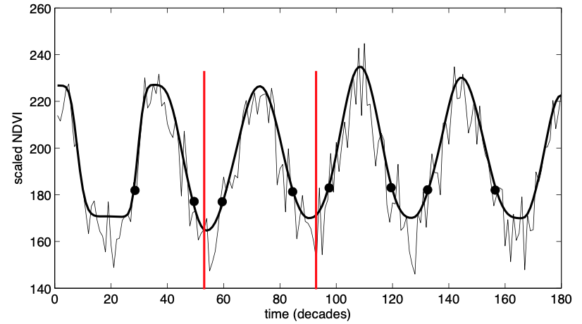
<figcaption><p>Figure 19: To extract information from the seasonality
file for a specific season a time window must be defined. The season for
which the maximum of the season lies within the window is the desired
one.</p></figcaption>
</figure>

## Index files

TIMESAT generates index files that allow for faster access of the output
data files. The output files can be very large, and the index files can
considerably speed up access to specific locations. This is particularly
noticed when plotting data using e.g. the routines TSM_printseasons and
TSM_viewfits. The index files have the extension .ndx, and have the
following formats: For files with time series (\*.tts):

| *row*<sub>1</sub> | *col*<sub>1</sub> | *loc*<sub>1</sub> |
|-------------------|-------------------|------------------:|
| *row*<sub>2</sub> | *col*<sub>2</sub> | *loc*<sub>2</sub> |
| *row<sub>n</sub>* | *col<sub>n</sub>* | *loc<sub>n</sub>* |

where *row* and *col* are the pixel locations containing data in the
.tts file, and *loc* is the location of the beginning of the row/col
numbers in bytes from the beginning of the .tts file. *row, col* and
*loc* are double integers (int64).

For files with seasonality data (\*.tpa):

| *row*<sub>1</sub> | *col*<sub>1</sub> | *nseas*<sub>1</sub> | *loc*<sub>1</sub> |
|-------------------|:-----------------:|---------------------|------------------:|
| *row*<sub>2</sub> | *col*<sub>2</sub> | *nseas*<sub>2</sub> | *loc*<sub>2</sub> |
| *row<sub>n</sub>* | *col<sub>n</sub>* | *nseas<sub>n</sub>* | *loc<sub>n</sub>* |

where *row*, *col* are pixel numbers, *nseas* is the number of seasons
for this pixel, and *loc* is the location of the beginning of the
row/col numbers in bytes from the beginning of the .tpa file. *row, col,
nseas* and *loc* are double integers (int64).

Part III

Software User’s Guide

# Installation of TIMESAT and program structure

## System requirements

The TIMESAT package consists of routines developed in Matlab and
Fortran. It has been developed under Windows and tested also under Linux
and Mac OS. Graphically, there are small differences between the
operating systems, but functionally not. The programs allocate memory
dynamically, and very large data sets can be processed. An exception is
the module TIMESAT_Lab that loads all requested data at once and thus
may experience memory limitations.

|  | **Windows** | **Linux** | **Mac** |
|:---|:---|:---|:---|
| **Operating system** | Windows 10 or later | Ubuntu/Red Hat | macOS 10.15.7 or later |
| **Processor** | Intel or AMD x86-64 processor | Intel or AMD x86-64 processor | Intel or AMD x86-64 processor |
| **RAM** | \> 4 GB | \> 4 GB | \> 4 GB |
| **Storage** | 3 GB | 3 GB | 3 GB |

Table 2. System requirements

## Installation

We are supplying executable files of TIMESAT that can run directly under
Windows, Linux, or Mac.

The most common installation steps are:

### Step 1. Download and Run TIMESAT Installer

1.  Download Installer. Download TIMESAT Installer from the official
    website (<https://web.nateko.lu.se/timesat/timesat.asp>). For each
    operation system, there are two installer files (Installer_web and
    Installer_mcr). Download **ONE** of them. Installer_web will
    download MATLAB Runtime from the internet, and Installer_mcr
    contains MATLAB Runtime already. **Use the installer with MATLAB
    Runtime (Installer_mcr) if you don’t have full control of your
    internet connection.**

2.  Start the installer. When asked if you want to allow the application
    to make changes, answer **Yes**.

3.  Click **Next**.

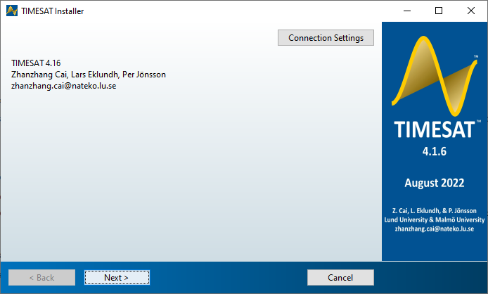

### Step 2. Select Destination Folder for TIMESAT

The destination folder is where you want to install TIMESAT. Accept the
default installation folder or click **Browse** to select a different
one. The destination folder must be on an absolute path.

When specifying a folder name:

- You can use any alphanumeric character and some special characters,
  such as underscores.

- You cannot use non-English characters.

- Folder names cannot contain invalid characters and the destination
  cannot be named “private.”

If you make a mistake while entering a folder name and want to start
over, click **Restore Default** **Folder**.

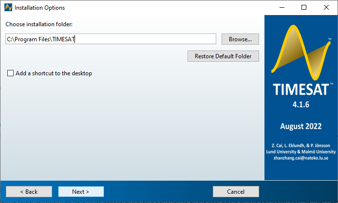

### Step 3. Select Destination Folder for MATLAB Runtime (if no MCR)

The installer will automatically detect if MATLAB Runtime is available
on the system. It will download (TIMESAT_win_Installer_web.exe) or
direct install (TIMESAT_win_Installer_mcr.exe) based on which installer
you use. If your computer already installed MATLAB Runtime, it will
directly jump to the final install page.

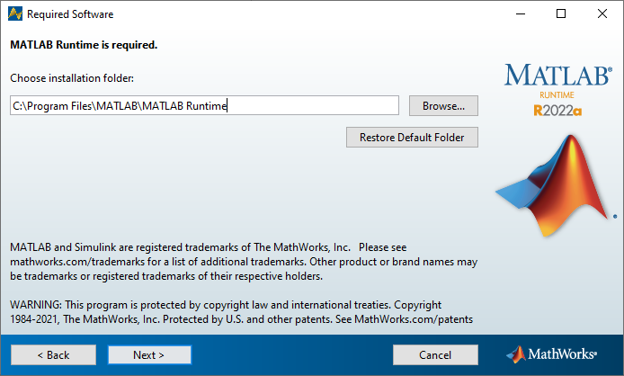

Click **Next**, and Accept the license agreement. Click **Next** again
to the final install page.

### Step 4. Install

Click **Install**.

# Program and processing overview

## Processing logic

TIMESAT consists of several different modules. Graphics-oriented
programs are coded in Matlab, and programs for processing large data
sets are coded in Fortran to achieve the fastest possible execution. The
general logic of the processing is given in Figure 20 and is briefly
explained here. The main processing steps in Figure 20 are described by
numbers in the left margin of the figure:

1\. Preparation of input data and previewing of binary images. Three
types of data are accepted, ASCII files of single or multiple data
series, full sets of binary images in time sequence, or Excel sheets. To
view image data the program \<View input/output images\> is used.

2\. Running TIMESAT for selected image pixels or time-series using the
program \<TIMESAT Lab\>. This allows the user to check the quality of
the input data and to select suitable fitting algorithms and settings
for running the full data sets.

3\. Creation of a settings file. This is done by \<TIMESAT Lab\>. The
settings control how TIMESAT treats the input data. Two types of input
settings exist: general settings that control the processing of all
pixels, and class-specific settings that control processing for a given
land cover class <span class="mark">(cf. sections 5.2 and 5.3).</span>

4\. Running TIMESAT for full data sets using the settings file generated
in the previous step. This is normally done from a command window using
the Fortran program TSF_process. Output data consist of binary files for
seasonality data and fitted data, each file containing the result for
all input series e.g., all image pixels <span class="mark">(cf. sections
6.1 and 6.2).</span>

5\. Generation of output images from the TIMESAT output files. This
includes viewing of seasonality data or fitted data for single pixels
and creation of image files of seasonality and fitted data for given
time periods. Several routines are available for these purposes (cf.
section 6.4). For a full description of the processing steps please go
to the appropriate sections in chapter 10.

## Program versions

Timesat 4.1 was written in Matlab ver. 2022a. Fortran programs were
compiled with the Intel Fortran Compiler XE 2021.7.1 (Windows), 2021.3.0
(Mac OS), and 19.0.1.144 (Linux) compiler.

<figure>
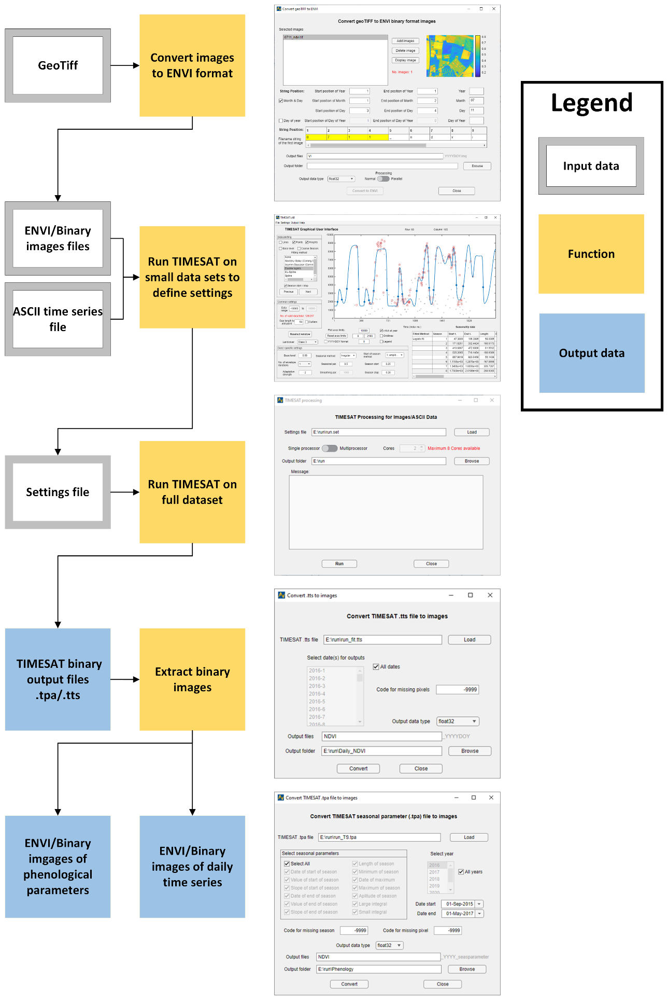
<figcaption><p>Figure 20: General TIMESAT processing logic. The numbers
in the left margin describe the step involved in the data processing.
Please refer to the text for further details.</p></figcaption>
</figure>

# Getting started with TIMESAT – a quick tutorial

This tutorial describes the general steps involved in the processing of
time-series data with TIMESAT. The tutorial is meant for getting started
with TIMESAT, and more detailed information about the separate functions
is given in the reference manual in chapter 10. The tutorial follows
Windows conventions, and Mac and Linux users must change the file
separator from \\ to /. The sample files for the tutorial are found in
the directory \data. The subfolder \data\img contains Normalized
Difference Vegetation Index (NDVI) and Plant Phenology Index (PPI) data
from the Copernicus Hight-Resolution Vegetation Phenology and
Productivity product (HR-VPP)[^1] over a window covering a part of
southern Sweden. There are also accompanying QFLAG quality data together
with a land cover data file landcover.tif with six broad classes (cf.
section 2.2). This data set will be used in the beginning of the
tutorial.

The subfolders \ASCII and \Excel contain time-series files for selected
areas in Sweden. <span class="mark">The file MODIS_NDVI_Sweden.txt
covers 9 years with 23 data values per year. Data in the two ASCII files
will be used further on in the tutorial. Basic information about the
test data is summarized in the table below.</span>

## Data

Before running TIMESAT it is necessary to prepare all the input data
correctly. TIMESAT expects a data series, and fits functions to each
time-series provided that there is a seasonality pattern in the data.

### Input images

TIMESAT needs a sequence of vegetation index images covering a
particular geographical area (cf. section 2.2). Images can be downloaded
from some data provider e.g. Copernicus. Example of vegetation index and
quality images are provided in the folder \data\img\ppi, \data\img\ndvi,
and \data\img\qflag.

### Land cover image file

TIMESAT can process data for separate land cover classes (cf. sections
5.2 and 5.3). An image file that assigns a code (e.g., Table 3,
/data/img/Landcover.tif) to each pixel needs to be present. Each code
represents a land cover class.

| Code | Land cover type |
|:----:|:----------------|
|  1   | Forest          |
|  2   | Wetland         |
|  3   | Arable land     |
|  4   | Grassland       |
|  5   | Artificial land |
|  6   | Water           |

Table 3. Land cover types

### Single time-series data

An alternative to using images is to extract time-series data for
certain pixel locations into an ASCII or Excel (.xls or .csv) file, and
process these from the file (cf. section 2.1). Several time-series can
be processed, and the file format is defined in sections 2.1 and 10.15.
It is also possible to corresponding quality codes in a similar ASCII or
Excel file. Examples of single ASCII and Excel files are provided in the
folder \data\ASCII and \data\Excel.

## Starting the TIMESAT menu system

The main driver for all TIMESAT processing is a menu system. The menu
system is divided into three logical areas: data preparation, data
processing, and post processing (see Figure 22). To start the menu
system please follow the instructions below.

<figure>
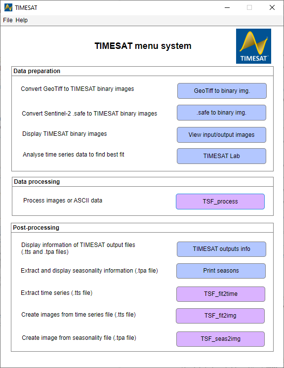
<figcaption><p>Figure 1: TIMESAT menu system. The system is divided into
three logical areas: Data preparation, Data processing, and
Post-processing.</p></figcaption>
</figure>

## GeoTiff to ENVI binary images

TIMESAT allows images in the ENVI binary format. Therefore, the images
in the \data\img folder are required to transfer to the ENVI format. To
achieve this automatically, TIMESAT provides a tool, **GeoTiff to binary
images**. This tool can also create a file list based on the file names
for use with TIMESAT ([Figure 2](#_Ref128584855)).

Click **Add images** to add all images in the \data\img\ndvi folder.
Image can be displayed on the right plate by clicking **Display image**.
Locate the string position of year, e.g., 6 - 9. Select the format of
date information in the filename, **Day of year** in this example, and
locate the string position of day of year, e.g., 10 – 12. After filling
**output files** and **output folder**, click **convert to ENVI** for
converting the images from geotiff to ENVI binary format and generating
a file list of the images and a time vector.

Landcover data can be converted by this tool as well. If neither Month &
Day nor Day of year is selected, the tool will not generate a file list
or a time vector.

<figure>
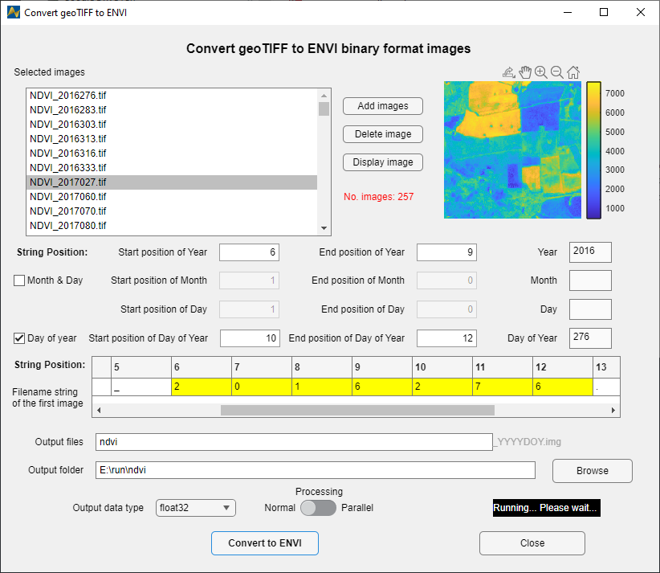
<figcaption><p><span id="_Ref128584855" class="anchor"></span>Figure 2.
GeoTiff to binary images. The tool can be used to convert geoTiff images
to ENVI binary format.</p></figcaption>
</figure>

## View input/output images

### Viewing images

We will illustrate this program (see [Figure 3.](#_Ref128584582)) by
viewing one of the binary image files generated in the section 9.3.
Start **View input/output images** from the Timesat menu system. Under
File, Open image file, browse to the folder containing ENVI images,
e.g., E:\run\ndvi, and click on the ndvi_2017027.img file. If the
corresponding hdr file is available, data type and image size will be
filled in automatically. Otherwise, you will need to fill in the values
by yourself. Click the **Draw** button. To modify the Image display
scaling you can increase the Minimum value to about 1000 and decrease
the Maximum value to about 7000 (enter these numbers in the edit boxes
near the bottom left window corner or use the sliders). Also try out the
other options below the image area: Lock axes, Grid on/off, Datatip
on/off, and Color scale.

### Browsing through several files

You can also use the function **Open file list** under File to load file
list generated in the section 9.3. Click on the **Open file** list
button and browse to the folder, e.g., E:\run\ndvi, and select the file
list file, e.g., filelist_ndvi.txt file. Select one image from the drop
down list on the top right. If the corresponding hdr file is available,
data type and image size will be filled in automatically. Otherwise, you
will need to fill in the values by yourself. Click the **Draw** button.
You can then point to another file in the list and just click the
**Draw** button again to view this image file.

<figure>
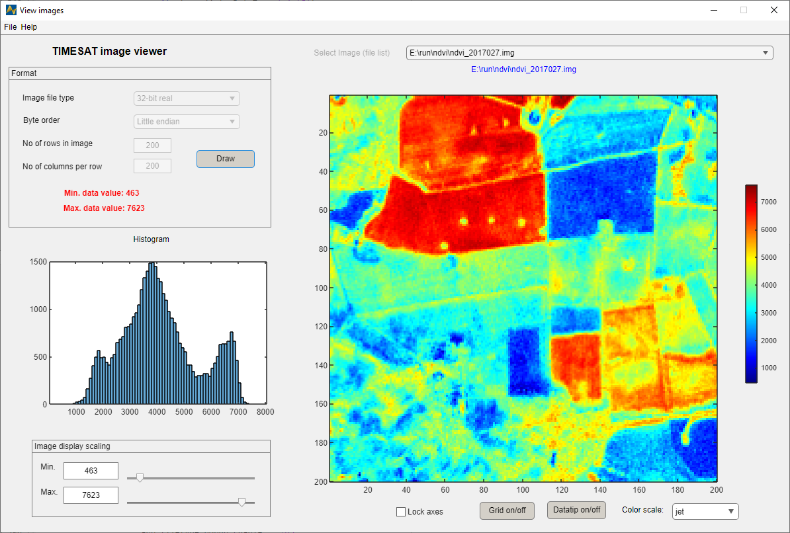
<figcaption><p><span id="_Ref128584582" class="anchor"></span>Figure 3.
View images. The tool can be used to view input/output ENVI
images.</p></figcaption>
</figure>

### Viewing quality data and land cover data

The same viewing process can be applied to quality data as well. When
you are done viewing and testing the program you may exit **View
input/output images**.

## TIMESAT Lab

### Loading ENVI binary image data

In this example we will load and process data stored in binary
vegetation index images from the section 9.3. Make sure **TIMESAT LAB**
is started, and choose *File*, *Open list of image files* ([Figure
4](#_Ref129095320) left). This will ask you to select a file list with
names of binary images in sequence, which is generated in the section
9.3. Since the images have header files, *.hdr*, the number of rows and
columns will be filled automatically. Press *Show image* ([Figure
4](#_Ref129095320) right). This is not mandatory but allows you to
preview the images in the file list and to select a processing window.
Press the button Processing window, which gives a movable hair cross,
and select a small area of approximately 10 × 10 pixels roughly at
locations rows 91–100 and col 111–120. Press Return when you are done.
Back in the image_files_input window you will now see that the selected
window coordinates have been filled into edit boxes Rows to process and
Columns to process. If you are not satisfied you can modify these
coordinates to the ones above manually.

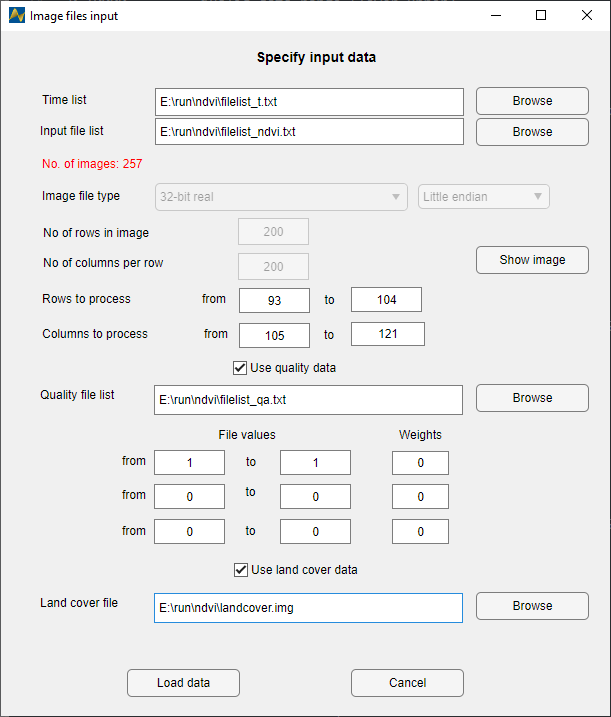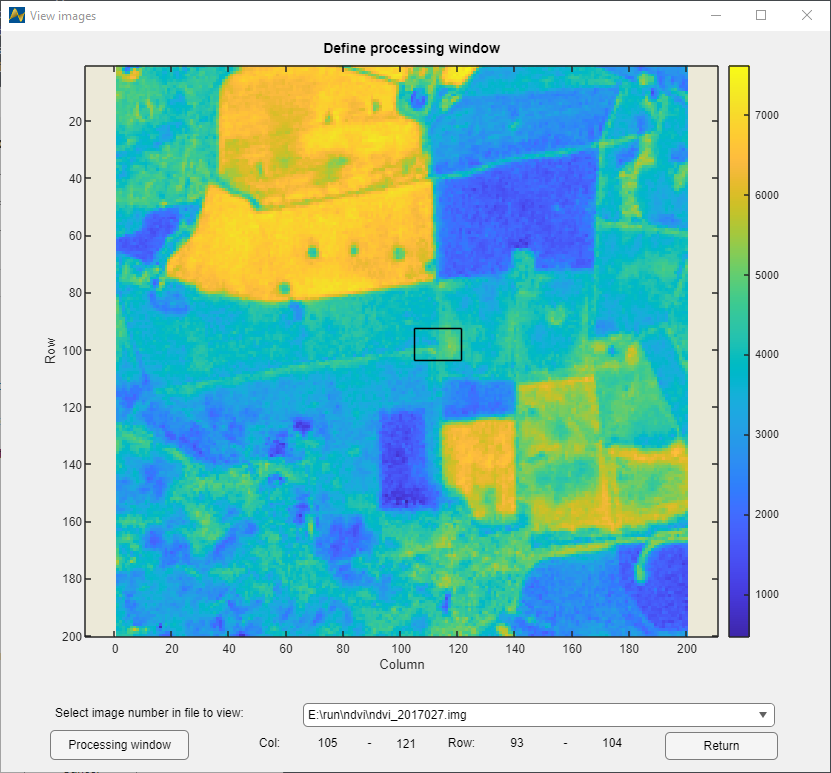

<span id="_Ref129095320" class="anchor"></span>Figure 4: open list of
image file (left) and show image (right).

### Weighting observations with quality data

Check *Use quality data* in the Image files input dialog and use the
*Browse* button next to the *Weight list file* and open the file list of
quality data from the section 9.3. Under *File values* type the
following

<table style="width:52%;">
<colgroup>
<col style="width: 10%" />
<col style="width: 10%" />
<col style="width: 5%" />
<col style="width: 5%" />
<col style="width: 7%" />
<col style="width: 2%" />
<col style="width: 10%" />
</colgroup>
<thead>
<tr>
<th colspan="3" style="text-align: center;">File values</th>
<th colspan="2" style="text-align: center;"></th>
<th colspan="2" style="text-align: center;">Weight</th>
</tr>
</thead>
<tbody>
<tr>
<td style="text-align: center;">From</td>
<td style="text-align: center;">1</td>
<td colspan="2" style="text-align: center;">to</td>
<td colspan="2" style="text-align: center;">1</td>
<td style="text-align: center;">1</td>
</tr>
<tr>
<td style="text-align: center;">From</td>
<td style="text-align: center;">0</td>
<td colspan="2" style="text-align: center;">to</td>
<td colspan="2" style="text-align: center;">0</td>
<td style="text-align: center;">0</td>
</tr>
<tr>
<td style="text-align: center;">From</td>
<td style="text-align: center;">0</td>
<td colspan="2" style="text-align: center;">to</td>
<td colspan="2" style="text-align: center;">0</td>
<td style="text-align: center;">0</td>
</tr>
</tbody>
</table>

The above values will assign the weights in the right column to the data
ranges under file values. We will here assign the highest weight to
value of one (SCL=4 and 5 in Sentinel-2 L2A data). We use the weight 0
for other values, which will ignore those data in processing.

### Load land cover data

Select *Use land cover data* and *Browse* the land cover ENVI image
generated in the section 9.3. Now press *Load data*. Select *Double
logistic* fit under *Fitting method*. You should see a curve like the
one in [Figure 5](#_Ref129104471).

**Viewing options.** In the **TIMESAT LAB** window try to check or
uncheck *Lines*, *Points*, and *Weights* next to Data plotting to see
the raw data and which data points are assigned what weights. On the
right-hand side of *Plot axes limits*, four slots can be used for
defining the lower and upper limit of x and y axis.

**Common settings.** These settings affect all pixels in the images,
irrespective of class (cf. sections 5.2 and 5.3). The first to set is
*Data range*. Set the range from -2000 to 10000 since these are the
minimum and maximum values of the NDVI data used in this example. All
values outside this interval will be ignored in the processing of full
imagery. You may try to set this to a more narrow interval, e.g. 5000 –
10000, but too few pixels will be available for processing and the pixel
will be skipped. Set the values back to 0 to 10000. Then try decreasing
*Gap length to add point* from 50 to 0. It means that TIMESAT will add a
base value if there is a gap larger than the number. With *Gap length to
add point* of 0, base value is added to all gaps, which makes the fit
far away from the raw data. So change it back to 50, which means that
TIMESAT allows a relatively larger gap size. Next setting to try is
*Outliers*. The *Outliers* indicates that TIMESAT can detect outliers in
time series data, but it may not affect the fit of the model in cases
where there are no outliers present.

<figure>
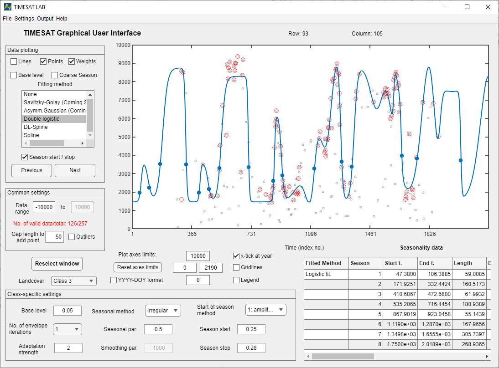
<figcaption><p><span id="_Ref129104471" class="anchor"></span>Figure 5:
TIMESAT LAB showing scaled NDVI over arable land of southern Sweden, row
93, column 105. The double logistic model fit is displayed along with
the raw data values.</p></figcaption>
</figure>

**Class-specific settings.** These settings are specific to individual
land classes (cf. sections 5.2 and 5.3).

Then check *Base level* to see the base line of the time series (cf.
section 3.1).

TSM_GUI only recognizes one land class, but when running whole images
using TSF_process, it is possible to process data individually for
different land classes. The first class-specific setting is the Seasonal
parameter. Set this to 1 since we assume a single season per year (and
to 0 if you assume dual seasons per year). We will explore this more in
another example. Then go on to No. of envelope iterations. When it is
set to 1 no envelope adaptation is carried out, and when set to 3
maximum adaptation is done (cf. section 3.4). This can be further fine
tuned using Adaptation strength. Minimum strength is 1 and maximum is
10. Try different values, then set it to 2 and No. or envelope
iterations to 3. The last setting to discuss is Force minimum. This
setting can be used to force minimum values to a certain value. Check
the box and enter a value of 160 to see the effect. All values below 160
will now be forced to 160. Uncheck the box for the remainder of this
demonstration. The rest of the settings under Class specific values have
been discussed above. Now, go through a number of pixels by clicking the
button Plot next series under Data plotting and try to find common and
class specific settings that make the curves fit nicely to the data.
This is more of an art than a science and has to be made with due
consideration to the nature of the ground target and type of satellite
data used.

**Saving settings to file.** To save the settings currently selected
choose Settings, Save to settings file. This will start the tool
TSM_settings and parse all the current TSM_GUI settings to the tool
(Figure 25). Common settings are found in the left frame and class
specific settings in the right frame. In addition there are some more
settings related to e.g. the type of output data (see sections 6.1 and
6.3) and land classes that may be chosen. Go to Job name and enter
west_africa. This is an important setting that determines the names of
all output files when running TSF_process. Then go to Output data and
set seasonality, fitted data, and original data all to 1 so that the
files .tpa and .tts will be printed. Now save the settings to an output
file by going to File, Save settings file as. Type the name west_africa
and click Save. Then exit TSM_settings and return to the TSM_GUI window.
You may now view the new file west_africa.set, which resides in the run
directory, with any file editor.

Loading settings from file. To demonstrate how settings are loaded from
file you can

now exit TSM_GUI to clear all settings. Then open it again from
TSM_menu. Load the settings file saved in the previous step by going to
Settings and choosing Load settings file.

Browse to the file west_africa and click on Open. The data and settings
specified in the file

west_africa.set will now be loaded.

Managing data with dual seasons In TSM_GUI go to File, Open ASCII data
file. Browse to the \data\single directory under Timesat, and select the
file AVHRR_Egypt_82-93.txt. This ASCII file contains 12 years of 10-day
NDVI-composite data (scaled values) from the NOAA AVHRR sensor over a
point in the Nile valley. Load the data and select Logistic fit. With
the default setting of the Seasonal parameter (under Class-specific
settings) of 0.5, the logistic curve will not fit well to the data. If
you check Coarse seasonality the resulting curve of the initial coarse
fit is shown (see section 3.5). Now, change the Seasonal parameter to 0
to force the seasonality to dual seasons instead of a single season.
Both the coarse fit and the logistic fit will now match the data better.
To improve the fit you may need to zoom in on a few years. You may then
try different settings of No. of envelope iterations and Adaptation
strength. Weighting observations with quality data Load data for West
Africa using the previously saved settings file west_africa.set
(Settings, Load settings file. Go to File, Open list of image files and
check Use quality data. We will now use quality indices from the CLAVR
(Clouds from AVHRR) data set to weight the function fitting in Timesat
(see section 3.2). The quality indices are stored in binary image files
of the same data type and format as the NDVI image data. Use the Browse
button next to the Weight list file, and open the file clavrlistwa.txt
in the \data\wa directory. Under File values type the following File
values Weight From 1 to 12 0.1 From 13 to 22 0.5 From 23 to 31 1.0 The
above values will assign the weights in the right column to the data
ranges under file values. We will here assign the lowest weight to
values between 1 and 12 (cloudy). We use the weight 0.1 rather than 0.0
to the lowest class to avoid possible problems that might arise if long
sequences of data of low quality occur. For the middle class (mixed) we
assign weight 0.5 to values between 13 and 22. For the highest class
(clear) we assign weight 1.0 to values between 23 and 31. Then press
Load data. The chosen weights 0.1, 0.5 and 1.0 are arbitrarily chosen
and represent the relative influence we want to assign each of the
categories in the data fitting. Back in the TSM_GUI window check Weights
under Data plotting to see which data points are assigned what weights.
A pixel where the effect of using or not using weighting with the above
values will have a strong effect is row 111, column 117. Load this pixel
(File, Open list of image files) and try varying the weight values to
see what the effect will be on the fitted curve. Reset the data to the
above values and save the new settings to west_africa.set by going to
Settings, Save to settings file. In TSM_settings save the file and
overwrite the old west_africa.set.

### Loading and processing ASCII time-series files

In this example we will load and process data stored in an ASCII
time-series file. Click on **TIMESAT Lab** in the Timesat menu system
and a window similar to the one displayed in Figure 24 will show up.
Then select File, Open ASCII data file. Use the Browse button to open
the file \data\single\MODIS_NDVI_Sweden.txt. This file contains NDVI
data from MODIS for the time period 2000 – 2008. Note the preview of the
file contents loaded into the window. The first row shows that there are
9 years of data, 23 observations per year, and 3 time-series. Press Load
data. The raw data from the first row of the file will load into the
plotting area of TSM_GUI.

Next, choose the different options under Data plotting. Note the
different fits achieved with Gaussian, Logistic and Savitsky-Golay. More
than one fitting method can be displayed simultaneously by holding the
ctrl-key while selecting method with the mouse. The fits are affected by
a number of options for detecting spikes, adapting to the upper envelope
etc. These options can be controlled by choices (check boxes and
buttons) in the GUI either under Common settings or Class-specific
settings. The different options are discussed in detail in section 5.3.
When Savitsky-Golay is selected you may change the Savitsky-Golay window
size under Class specific settings (cf. sections 3.6 and 5.3). Try a
large and small window size. Note that the change of the window size
takes effect when you hit enter or click outside the editing area. There
are more options, including the Spike method, Number of envelope

iterations and Adaptation strength, that you might want to explore. When
any of the fitting methods is selected, seasonality parameters for each
of the defined seasons are shown under Seasonality data to the right.
More information about these parameters is given in section 4.4. To
write the parameters to file select the Output menu and choose Write
seasonality data to file. Now a file named seasonality.txt will be found
in your working directory. You can open this file with any text editor.
Note that the number of seasons equals n−1 in case of single seasons and
2n−1 in case of dual seasons, where n is the number of years. You can
change the definition of the beginning and end of seasons. Make sure
that at least one fitting method is selected, and select Season
start/stop under Data plotting. Keep the Start of season method (under
Class specific settings) at 1 and modify the Season start and Season
stop settings. These settings can be varied between 0 and 1 and define
the fraction of the amplitude used for determining the beginning and end
of the seasons (cf. section 5.3). After that you can test choosing 2
under Start of season method.

This option means that an absolute y-value that defines the beginning
and end of seasons will be used. Select 2 under Start of season method,
and modify the values under Season start and Season stop. Try values
between 0 and 0.65 to see the effect. Please note that the check boxes
and buttons in the GUI correspond to the input settings described in
5.3. Some of the input settings, such as the number of years and the
number of observations per year, are defined already when data are
loaded. As we will describe later the selected options can be
transferred to the settings file.

### Loading and processing Excel time-series files

## TSF_process

## Post-processing the results of a TSF_process run

### TIMESAT outputs info

### Print seasons

### TSF_fit2time

### TSF_fit2img

### TSF_seas2img

## Checklist for processing new vegetation index image data

# Reference manual

This chapter contains specifications of all the programs included in
TIMESAT. Programs coded in Fortran are all given the prefix TSF\_
(Timesat Fortran).

## TSM_menu

## View input/output images

## TSM_GUI

## Data input for TSM_GUI

### Loading binary image data

When selecting File, Open list of image files in TSM_GUI the window
image_files_input (Figure 32) is loaded. Specify a file containing a
list of binary input images (see section 9.1) under File lists. The file
names should be given with a relative or full path. The format of the
image files listed is specified in section 10.15 under Image data files.

After specifying the input file list, the data format is given in the
window. Note that No. of images/year will be automatically computed from
the data in the file and the value given under No. of years, No of rows
in image, and No of columns per row should define the size of each input
file. However, Rows to process and Columns to process define the
specific area that TSM_GUI will attempt to load. TSM_GUI loads all
specified data into primary memory, hence, defining a very large area
may lead to memory allocation problems. It is thus advisable to process
only a small portion of the data at the time. Use the button Show image
to get a preview of the binary images. Note that loading of large images
can be very slow. In preview, a box defining the rows and columns to be
processed can easily be defined graphically.

Select Use quality data when quality data for weighting the image data
are to be used. The quality images should have formatting that is
identical to the input images. Three data intervals and three
corresponding weights associated with each interval are specified. The
Load data button will not be activated until all necessary values have
been provided.

### Loading data from ASCII file

### Loading data from Excel file

## Settings in TSM_GUI

Settings in TSM_GUI will be implemented immediately for the time-series.
Display can be slow when multiple processing is done, e.g. fitting with
different methods, or fitting very long data series. The choices under
Data plotting control the display of the current time-series. When
selecting Savitzky-Golay, Asymm. Gaussian, Double Logistic, or STL
season / trend, the fitted data will be displayed along with the
original data, and seasonality parameters will be shown in the window
Seasonality data. Choosing Coarse seasonality displays the results of
the sinusoidal fit (section 3.5). The button Plot next series will load
the next data series (column and row when input is from images, or next
line when input is from ASCII file). Under Common settings settings that
will be valid for all pixel classes are found. These typically define
criteria for including or excluding time-series, e.g. if the amplitude
is too low, or if too few data values lie within the data range. Under
Class-specific settings those settings are defined that can be applied
differently to different classes when running the TSM_process module.
TSM_GUI, however, does not recognize different classes when processing
time-series. The meaning of the different settings is defined in section
5.3 in the description of the settings file.

When the user is satisfied with the settings for a given area or land
class, these can be stored to file by going to Settings, Save to
settings file. This starts the TSM_settings program and transfers the
current settings to that program. Values can be modified, classes can be
added, and data can be stored to a settings file. Values modified in
TSM_settings will not be returned to TSM_GUI.

## Output files from TSM_GUI

Various ASCII data can be written from TSM_GUI for selected time-series.
These will be written to the working directory under the following
names:

seasonality.txt Seasonality data for each season

sg.txt A single line of fitted values using the Savitzky-Golay method

gauss.txt A single line of fitted values using the asymmetric Gaussian
method

logistic.txt A single line of fitted values using the double logistic
method

STL_season.txt A single line representing the STL seasonal curve

STL_trend.txt A single line representing the STL trend line.

## TSM_settings

## TSF_process

## TSF_process parallel

Using this option enables execution of TSF_process in parallel mode. It
is a two-step process. In the first step, the user specifies the number
of processes to run. This is determined by the available processors on
the current machine. If e.g. 10 is specified, the job will be divided
into ten equal parts, and ten individual settings files will be
generated. In Linux a report of this step is written to a file called
output which can be viewed to make sure that it has com- pleted
correctly. A script file named jobname_script.bat (Windows) or
jobname_script.sh (Linux) will be generated. The script file contains
commands for starting the parallel jobs, for merging the resulting files
(see TSF_merge below), and for deleting temporary files. In the second
step the script file is executed. This is done by typing jobname_script
(DOS) or ./jobname_script.sh (Linux) at the command prompt. When the
jobs are executed re- ports will be written to files called output1.txt,
output2.txt ...etc. (Windows) or output1, output2... etc. (Linux). These
can be viewed with an editor to see the status of the jobs, and to
ensure that the jobs have finished without errors. Please note that a
number of oper- ating system commands are used in the script files which
are not always identical on different operating system versions. The
Linux version uses the Unix Bash shell; users running other shells may
be required to rewrite the script. To ensure correct execution of the
jobs the user is advised to first try out parallel processing on a small
subset of the data to make sure that the whole process is completed
without errors. It should also be noted that it is not advisable to use
the maximum number of processors on the machine (or exceed it) since
this may deplete all system resources.

## TSM_fileinfo

This program is used for displaying the structure of a Timesat output
file (.tpa or .tts). The output information will display the following
data: no. of years, no. of points per year, total no. of points, no. of
rows and columns, extent of processing window. In addition it will
display a map showing the number of seasons (.tpa) or number of years
(.tts) of data stored in the file. The map is to help the user to
identify the geographical area that has been processed. If single
time-series data are processed the map is not displayed.

## TSM_printseasons

## TSM_viewfits

## TSF_fit2time

## TSF_fit2img

## TSF_seas2img

## Running from the command prompt to automate processing

TSF_process and the other Fortran programs can be executed without first
starting Matlab. It is then necessary to reference the full program
including the path (e.g. c:\TIMESAT33\timesat_fortran\main\TSF_process),
or to add the program folders to the DOS or Linux path. An alternative
is to copy the executable files into the run directories and execute
from there. In Windows the programs are named \*.exe and in Linux they
are named

\*.x64 (e.g. TSF_process.x64).

It is possible to automate processing by starting jobs from script files
that can execute a series of Timesat commands, e.g.:

TSF_process sahel.set

TSF_fit2img sahel_fit.tts 0 sahel_image.rst 3 -1

TSF_seas2img sahel_TS.tpa 3 33 75 0 0 length 3

In Windows the script file must be named \*.bat and is executed by
typing the name at the command prompt. In Linux any name could be used.

## Working in Linux and Mac as compared to Windows

Most TIMESAT functions in the Linux version are identical to those in
Windows (as described in this manual), however certain differences
exist. Notably, all file directories are specified with a forward slash
(/) instead of the backward slash. Furthermore, execution of the Fortran
programs differs somewhat between Windows and Linux/Mac OS. A further
modification that may be necessary if processing a large number of files
is to execute the following line (or add to the .bashrc file): ulimit -n
9600 (allows opening of up to 9600 files simultaneously).

## Input files for TIMESAT

### Vegetation index image files

Image data to be processed in TIMESAT, e.g. data from a satellite
sensor, should be formatted as ENVI binary format. Values can be stored
as 8-bit integer (0 – 255), 16-bit signed integer (-32767 to +32768), or
32-bit real (decimal values between 1.2 × 10<sup>-38</sup> and 3.4 ×
10<sup>38</sup>). One binary file and one header file are used for
storing a single image. This is a generic format that can be
imported/exported by most image processing software.

### Quality image files

These files contain numeric values corresponding to the observation
quality of the image data. The file format and organization should be
identical to that of the vegetation index image data. The quality values
will be translated into a maximum of three classes. Numeric values that
will belong to a certain weight class need to be grouped, e.g. 1 – 10
corresponding to the weight 0.1, 11 – 20 corresponding to the weight
0.5, and 21 to 30 corresponding to the weight 1.0. The assignment of
weights, e.g. 0.1, 0.5 and 1.0 is defined in a settings file and
determine the weight of the data point in the least-squares fit. A
weight of zero will mean that the observation is excluded from the fit.

### Image file lists

### Land cover file

This is a binary image file, organized like the ENVI binary vegetation
index image files, and with identical geometry and file format. Land
cover codes should be integer numbers starting from 1 and up to a
maximum of 255. If stored as real numbers these will be rounded to the
nearest integers. Each code should be defined in the settings file.
E.g., there are three types of land cover 1, 2, and 5, then TIMESAT will
define 1, 2, 3, 4, 5 in the settings file even 3 and 4 are not used.

### ASCII data file

### Excel file

### Settings file

This is an ASCII file containing settings for running TSF_process or
TSM_process. It should reside in the run directory. The file is created
and modified using TSF_settings, but can also be edited with an ASCII
file editor. The file contains information and one comment per row. The
table below shows the layout of the file (see also section 5.3 for a
detailed description of the settings).

| Row | Example | Short description | Explanation |
|:---|:---|:---|:---|
| 1 | Version: 3.3 |  | Keeps track of the settings file version |
| 2 | west_africa | Job name | Job name (no blanks) - max 100 chars. This will determine the name of output files from TIMESAT |
| 3 | 1 | Image/series mode (1/0) | 1 = image mode, 0 = ASCII time-series |
| 4 | 0 | Trend (1/0) | 1 = STL trend fitting activated. Overrules choice of fitting method (row 32). |
| 5 | 1 | Use quality data (1/0) | 1 = use quality data, 0 = do not use quality data |
| 6 | datalist.txt | Data file list/name | Name, followed by %, of file list (for images) or data file name (for ASCII data). |
| 7 | quallist.txt | Quality file list/name | Name, followed by %, of quality list (for images) or quality file name (for ASCII data) |
| 8 | 1 | Image file type | 1 = 8-bit unsigned integer, 2 = 16-bit signed integer, 3 = 32-bit real |
| 9 | 0 | Byte order (1/0) | 0 = little endian byte order, 1 = big endian byte order (for 16-bit integers) |
| 10 | 200 200 | Image dimension | No. of rows in image, and no. of columns per row |
| 11 | 111 120 91 100 | Processing window | Window to process (start row, end row, start column, end column) |
| 12 | 3 36 | Years and points per year | No. of years and no. of points per year |
| 13 | 1 255 | Valid data range | Lower and upper data values for valid range. Data outside range will be assigned weight 0 |
| 14 | 1 12 0.1 | Quality range 1 and weight | Lower and upper values for quality class 1 and assigned weight |
| 15 | 13 22 0.5 | Quality range 2 and weight | Lower and upper values for quality class 2 and assigned weight |
| 16 | 23 31 1 | Quality range 3 and weight | Lower and upper values for quality class 3 and assigned weight |
| 17 | 0 | Amplitude cutoff value | Cutoff for low amplitude. Series with amplitude smaller than this value will not be processed. 0 processes all data |
| 18 | 0 | Debug (3/2/1/0) | Debug flag. 1 - 3 = print debug data, 0 = do not print debug data |
| 19 | 1 1 0 | Output files (1/0 1/0 1/0) | Flags for output data (seasonality, fitted data, and original data) |
| 20 | 0 | Use land cover (1/0) | 1 = use land cover map, 0 = do not use land cover map |
| 21 | landcoverdata | Name of land cover file | Name, followed by %, of land cover file |
| 22 | 1 | Spike method (3/2/1/0) | Spike method. 3 = weights from STL multiplied with original weights, 2 = weights from STL, 1 = method based on median filtering, 0 = no spike filtering |
| 23 | 2 | Spike value | If spike method = 1 the spike value determines the degree of spike removal. A low value will remove more spikes |
| 24 | 0 | STL stiffness value | Parameter for STL trend stiffness. Varies between 1.0 and 10.0; default = 3.0. |
| 25 | 2 | No. of land cover classes | No. of land cover classes (if land cover data are used) |
| 26 | \*\*\*\*\*\*\*\*\*\*\*\* | Separator | After separator comes class specific parameters |
| 27 | 1 | Land cover code for class 1 | Land cover code for class 1 |
| 28 | 1 | Seasonality parameter (0-1) | A value near 1 will attempt to fit one season per year, a value close to zero will attempt to fit two seasons |
| 29 | 3 | No. of envelope iterations (3/2/1) | No. of iterations for upper envelope adaptation (3,2,1). Choosing 1 means no envelope adaptation. |
| 30 | 2 | Adaptation strength (1-10) | Strength of the envelope adaptation. 10 is the maximum strength. |
| 31 | 0 0 | Force to minimum (1/0) and value of minimum | Force to minimum. 1 = points below given minimum value will be forced to the specified minimum value. 0 = no forcing to value |
| 32 | 3 | Fitting method (3/2/1) | Fitting method. 3 = double logistic, 2 = asymmetric Gauss, 1 = Savitzky-Golay If STL trend fitting activated (row 4) this overrides the fitting method. |
| 33 | 1 | Weight update method | Weight update method (not in use) |
| 34 | 4 | Window for Savitzky-Golay | Half window for Savitzky-Golay filtering. A large value of the window will give a high degree of smoothing. |
| 35 | 0 | Reserved | Not in use |
| 36 | 0 | Reserved | Not in use |
| 37 | 1 | Season start start/end method (4/3/2/1) | Method for determining start/end of season based on intersection of the fitted curve. 4 = STL trend: at the intersection with the trend line from STL. 3 = Relative amplitude: at the point where the curve intersects a proportion of the relative seasonal amplitude. 2 = Absolute value: at the point where the curve intersects an absolute value in units of the data. 1 = at the point where the curve intersects a proportion of the seasonal amplitude. |
| 38 | 0.5 0.5 | Season start / end values | Values for determining season start/end If start method is 1 or 3 the values must be between 0 and 1 |
| 39 – |  | Separator and data | Same as rows 26–38, but for class 2 |
| 51 |  | for class 2 |  |
| 52 – |  | Separator and data | Same as rows 26–38, but for class 3 |
| 64 |  | for class 3 |  |
| · · · |  | · · · | · · · etc. for a maximum of 255 classes |

## Output files for TIMESAT

## Index files

TIMESAT generates index files that allow for faster access of the output
data files. The output files can be very large, and the index files can
considerably speed up access to specific locations. This is particularly
noticed when plotting data using e.g. the routines TSM_printseasons and
TSM_viewfits. The index files have the extension .ndx, and are
automatically generated when running the post-processing programs
mentioned above, if required. They can also be generated from the
TSM_menu under File. The format is described in chapter 6.5.

# Acknowledgements

Support from the Swedish National Space Board and European Environment
Agency is gratefully acknowledged. The authors are thankful for all
encouragement, comments and suggestions for improvements from the
TIMESAT user community. We would especially want to thank Feng Tian from
Wuhan University, Bruno Smets, Roel Van Hoolst, Kasper Bonte, and Bert
De Roo from VITO, and colleagues at Lund University: Jonas Ardö and
Hongxiao Jin.

# References

Barichivich, J., Briffa, K.R., Myneni, R.B., Osborn, T.J., Melvin, T.M.,
Ciais, P., Piao, S. and Tucker, C. (2013), Large-scale variations in the
vegetation growing season and annual cycle of atmospheric CO2 at high
northern latitudes from 1950 to 2011, Global Change Biology, 19,
3167-3183.

Beck, P.S.A., Jönsson, P., Högda, K.-A., Karlsen, S. R., Eklundh, L. and
Skidmore, A.K., 2007, A ground-validated NDVI dataset for monitoring
vegetation dynamics and mapping phenology in Fennoscandia and the Kola
peninsula. International Journal of Remote Sensing, 28, 4311-4330.

Cleveland, R.B., Cleveland,W.S., McRae, J.E., and Terpenning, I., 1990,
STL: A Seasonal- Trend Decomposition Procedure Based on Loess. Journal
of Official Statistics, 6, 3-73.

Eklundh, L., Johansson, T. and Solberg, S., 2009, Mapping insect
defoliation in Scots pine with MODIS time-series data. Remote Sensing of
Environment, 113, 1566-1573.

Eklundh, L. and Jönsson, P., 2003, Extracting Information about
Vegetation Seasons in Africa from Pathfinder AVHRR NDVI Imagery using
Temporal Filtering and Least-Squares Fits to Asymmetric Gaussian
Functions. In Image and Signal Processing for Remote Sensing VIII.
Proceedings of SPIE Vol 4885, S.S. Serpico (Ed.), 215-225. Society of
Photo-Optical Instru- mentation Engineers).

Eklundh, L. and Olsson, L., 2003, Vegetation index trends for the
African Sahel 1982-1999. Geophysical Research Letters, 30, 1430-1433.

Fensholt, R. and Proud, S.R. (2012), Evaluation of Earth Observation
based global long term vegetation trends Ů Comparing GIMMS and MODIS
global NDVI time series, Remote Sens- ing of Environment, 119, 131-147.

Gao, F., Morisette, J.T., Wolfe, R.E., Ederer, G., Pedelty, J., Masuoka,
E., Myneni, R., Tan,

B. and Nightingale, J., 2008, An algorithm to produce temporally and
spatially continuous MODIS-LAI time-series, IEEE Geoscience and Remote
Sensing Letters, 5.

Heumann, B.W., Seaquist, J. W., Eklundh, L. and Jönsson, P., 2007, AVHRR
Derived Pheno- logical Change in the Sahel and Soudan, Africa, 1982 -
2005. Remote Sensing of Environment, 108, 385-392.

Hickler, T., Eklundh, L., Seaquist, J., Smith, B., Ardö, J., Olsson, L.,
Sykes, M. and Sjöström, M., 2005, Precipitation controls Sahel greening
trend. Geophysical Research Letters, 32, L21415.

Hird, J. and McDermid, G.J., 2009, Noise reduction of NDVI time series:
An empirical com- parison of selected techniques. Remote Sensing of
Environment, 113(1), 248 -258.

Jamali, J., Jönsson, P., Eklundh, L., Ardö, J. and Seaquist, J., 2015,
Detecting changes in vegetation trends using time series segmentation.
Remote Sensing of Environment, 156, 182- 195.

Jönsson, P. and Eklundh, L., 2002, Seasonality extraction by function
fitting to time-series of satellite sensor data. IEEE Transactions on
Geoscience and Remote Sensing, 40, 1824-1832.

Jönsson, P. and Eklundh, L., 2003, Seasonality extraction from
time-series of satellite sen- sor data. In Frontiers of Remote Sensing
Information Processing, C.H. Chen (Ed.), 487- 500.(World Scientific
Publishing).

Jönsson, P. and Eklundh, L., 2004, TIMESAT - a program for analysing
time-series of satellite sensor data. Computers and Geosciences, 30,
833-845.

Jönsson, A.M., Eklundh, L., Hellström, M., Bärring, L. and Jönsson, P.,
2010, Annual changes in MODIS vegetation indices of Swedish coniferous
forests in relation to snow dynamics and tree phenology, Remote Sensing
of Environment, 114, 2719-2730.

Kanzow, C., Yamashita, N., and Fukushima, M., 2002, Levenberg-Marquardt
methods for constrained nonlinear equations with strong local
convergence properties.

Le Page, Y., Oom, D., Silva, J.M.N., Jönsson, P. and Pereira, J.M.C.,
2010, Seasonality of vegetation fires as modified by human action:
observing the deviation from eco-climatic fire regimes. Global Ecology
and Biogeography, 19, 575-588.

Madsen, K., Nielsen, H.B., and Tingleff, O., 2004, Methods for
non-linear least squares prob- lems, Informatics and Mathematical
Modeling (IMM), Technical University of Denmark.

Nielsen, H.B., 1999, Damping parameter in Marquardt’s method, Technical
Report IMM- REP-1999-05, Informatics and Mathematical Modeling (IMM),
Technical University of Den- mark.

Nielsen, H.B., 2000, Separable nonlinear least squares, Technical Report
IMM-REP-2000-01, Informatics and Mathematical Modeling (IMM), Technical
University of Denmark (2000).

Olofsson, P. and Eklundh, L., 2007, Estimation of absorbed PAR across
Scandinavia from satellite measurements. Part II: modeling and
evaluating the fractional absorption. Remote Sensing of Environment,
110, 240-251.

Olofsson, P., Eklundh, L., Lagergren, F., Jönsson, P. and Lindroth, A.,
2007, Estimating Net Primary Production for Scandinavian forests using
data from Terra/MODIS. Advances in Space Research, 39, 125-130.

Olofsson, P., Lagergren, F., Lindroth, A., Lindström, J., Klemedtsson,
L., Kutsch, W. and Eklundh, L., 2008, Toward Operational Remote Sensing
of Forest Carbon Balance across Northern Europe. Biogeosciences, 5,
817-832.

Olsson, L., Eklundh, L. and Ardö, J., 2005, A recent greening of the
Sahel - trends, patterns and potential causes. Journal of Arid
Environments, 63, 556-566.

Press, W.H., Teukolsky, S.A., Vetterling, W.T., and Flannery, B.P.,
1994, Numerical Recipes in Fortran, Cambridge University Press.

Seaquist, J.W., Hickler, T., Eklundh, L., Ardö, J. and Heumann, B.,
2009, Disentangling the effects of climate and people on Sahel
vegetation dynamics. Biogeosciences, 6, 469-477.

Seaquist, J.W., Olsson, L., Ardö, J. and Eklundh, L., 2006, Broad-scale
increase in NPP Quantified for the African Sahel, 1982-1999.
International Journal of Remote Sensing, 27, 5115-5122.

Sjöström, M., Ardö, J., Eklundh, L., El-Tahir, B.A., El-Khidir, H.A.M.,
Hellström, M., Pilesjö, P. and Seaquist, J., 2009, Evaluation of
satellite based indices for gross primary production estimates in a
sparse savanna in the Sudan. Biogeosciences, 6, 129-138.

Schubert, P., Eklundh, L., Lund, M. and Nilsson, M., 2010, Estimating
northern peatland CO2 exchange from MODIS time series data, Remote
Sensing of Environment, 114, 1178- 1189.

Schubert, P., Lagergren, F., Aurela, M., Christensen, T., Grelle, A.,
Heliasz, M., Klemedts- son, L., Lindroth, A., Pilegaard, K., Vesala, T.,
Eklundh, L., 2012, Modeling GPP in the Nordic forest landscape with
MODIS time series data - comparison with the MODIS GPP product, Remote
Sensing of Environment, vol. 126, 136-147.

Sjöström, M., Ardö, J., Arneth, A., Cappelaere, B., Eklundh, L., de
Grandcourt, A., Kutsch,

W. L., Merbold, L., Nouvellon, Y., Scholes, B., Seaquist, J. and
Veenendaal, E. M., 2011, Exploring the potential of MODIS EVI for
modeling gross primary production across African ecosystems. Remote
Sensing of Environment, 115, 1081-1089.

Stisen, S., Sandholt, I., Norgaard, A., Fensholt, R. and Eklundh, L.,
2007, Estimation of diurnal air temperature using MSG SEVIRI data in
West Africa. Remote Sensing of Envi- ronment, 110, 262-274.

Tottrup, C., Schultz Rasmussen, M., Eklundh, L. and Jönsson, P., 2007,
Mapping fractional forest cover across the highlands of mainland
Southeast Asia using MODIS data and regres- sion tree modelling.
International Journal of Remote Sensing, 28, 23-46.

Verbesselt, J., Jönsson, P., Lhermitte, S., van Aardt, J. and Coppin,
P., 2006, Evaluating satellite and climate data derived indices as fire
risk indicators in savanna ecosystems. IEEE transactions of Geoscience
and Remote Sensing, 44, 1622.

Verbesselt, J., Hyndman, R., Newnham, G. and Culvenor, D. (2010)
Detecting trend and seasonal changes in satellite image time series.
Remote Sensing of Environment, 114, 106-115

Yuan, H., Dai, Y., Xiao, Z., Ji, D. and Shangguan, W. (2011),
Reprocessing the MODIS Leaf Area Index products for land surface and
climate modelling, Remote Sensing of Environment, 115, 1171-1187.

[^1]: <https://land.copernicus.eu/pan-european/biophysical-parameters/high-resolution-vegetation-phenology-and-productivity>
